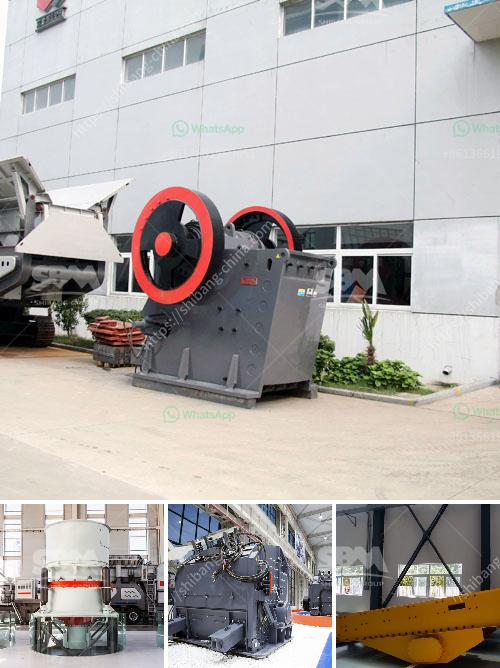

<h3>mobile screening machine south africa</h3>
South Africa, a country rich in natural resources, is known for its mining and construction sectors that have been driving economic growth for decades. These industries heavily rely on screening equipment to sort, separate, and size raw materials efficiently. In recent years, the demand for mobile screening machines in South Africa has surged, as they offer numerous benefits, including flexibility, mobility, and improved productivity.

One of the key advantages of mobile screening machines is their ability to operate in remote locations where access to electricity and infrastructure is limited. Traditional screening equipment, such as stationary plants, requires a fixed location with constant power supply, making it unsuitable for mining and construction sites in remote areas. Mobile machines, on the other hand, are self-powered and can be easily transported to any location, significantly reducing downtime and increasing operational efficiency.

The mobility of these machines also allows for greater flexibility in meeting changing demands and reducing operational costs. As raw materials are often unevenly distributed, mobile screening machines can be used directly at the source, eliminating the need for expensive transportation. The ability to adjust the screening process based on the specific requirements of each site ensures maximum efficiency and reduces wastage.

In addition to flexibility and mobility, mobile screening machines are equipped with advanced technology and features that enable higher productivity and accuracy in material sorting. These machines are designed to efficiently process a wide range of materials, including aggregates, sand, ore, and construction waste. The use of advanced screening techniques, such as vibration and rotary motion, ensures that materials are properly separated, resulting in high-quality end products.

The demand for mobile screening machines in South Africa is also driven by their environmental benefits. By processing materials directly on-site, these machines reduce the need for transportation and minimize the environmental impact associated with it. Moreover, the advanced screening technology used in these machines helps reduce waste and maximize the use of raw materials, contributing to a more sustainable and efficient operation.

Furthermore, the use of mobile screening machines in South Africa has also led to job creation and economic growth. As these machines require skilled operators and maintenance personnel, their utilization creates employment opportunities in various sectors, including training, hiring, and equipment maintenance. The increased productivity and efficiency provided by these machines also boost the overall economy by promoting faster project completion and higher output.

In conclusion, the surge in demand for mobile screening machines in South Africa is a testament to their numerous advantages in enhancing efficiency and productivity in the mining and construction sectors. The ability to operate in remote locations, their flexibility to meet changing demands, and the use of advanced technology make these machines a valuable asset for any operation. Not only do they maximize efficiency and productivity, but they also contribute to environmental sustainability and economic growth. As South Africa's industries continue to grow, the importance of mobile screening machines is expected to increase, making them a vital tool for success in these sectors.
<h3>Contact us</h3><ul><li><strong>Whatsapp:&nbsp;<a href="https://wa.me/8613661969651">+8613661969651</a></strong></li><li><a href="https://swt.shibang-china.com/?git&amp;zhl&amp;mobile screening machine south africa"><strong>Online Service(chat now)</strong></a></li></ul><h3>Related</h3><ul><li><a href='kenya stone crusher is made.md'>kenya stone crusher is made</a></li><li><a href='grinding mill machine price in chennai.md'>grinding mill machine price in chennai</a></li><li><a href='project cost of clinker grinding unit.md'>project cost of clinker grinding unit</a></li><li><a href='difference between chain and belt conveyors.md'>difference between chain and belt conveyors</a></li><li><a href='steel casting mining machinery parts wedge plate.md'>steel casting mining machinery parts wedge plate</a></li></ul>