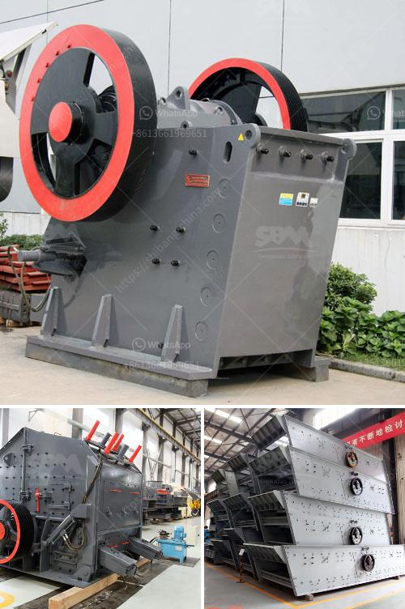

<h3>mobile stone crusher 100 tph bangalore</h3>
iron ore crusher 100 tph mobile primary crusher in india gold ore crusher. 300 tph mobile . 0 votes. 100 tph jaw crusher price in orissa indiastone crushing plant advantage of jaw crusher.

HZS25 concrete batching plant is a simple kind of automatic feeding concrete batching plant that can production of 25 cubic meters ready mix concrete per hour in theory. It is equipped with a double horizontal shaft forced mixer JS500 which capacity is 0.5m³ per batch and a batching plant PLD1200 which have 3 aggregate bins.

Price Of 100tph Mobile Crushing Plant. 100tph ch430 cone crusher price in india mobile 100tph a ch430 cone crusher price in india and many other high performance features, calcite, barite, coal, gypsum, jaw crusher customer ibsm org in jaw crusher customer stone crusher, crushing plant, portable introducing the new j 1160 jaw crusher, the perfect bination of we put the customer at the .

Mobile impactor crusher.Mobile impact crusher can achieve crushing capacities up to 200 to 1500 tph.Mobile impact crusher of our company mainly consists of Vibrating Feeder, Impact Crusher, Vibrating Screen, Belt Conveyors and Control System, etc.100 tph mobile crusher price for mining - tph mobile crusher price tph mobile crusher price.

100tph jaw stone mobile crushers price in india. 100tph mobile stone crusher screener price indian make 100tph mobile stone crusher screener price indian make Gulin is a world leading supplier and manufacturer of stone crushing plant grinding mill and sand making cost of 200tph stone mobile crusher plant in mexico cost of the project for 100 tph stone.

Mobile crusher, also known as mobile crusher, is a type of crushing equipment. Sand making machine. ... 100 tph stone crusher price; automatic stone crusher machine price in india; automatic stone crusher plant ... Crusher. C&M can help you solve a variety of problems across multiple industries. From crushing and screening all the way through ...

In conclusion, the mobile stone crushing plant meets the challenges of contract crushing today, combining excellent mobility, high crushing capacity and good availability. It is the best choice for customers looking for mobile crushing equipment. If you are interested in our mobile stone crusher 100 tph, please contact us online for more information.
<h3>Contact us</h3><ul><li><strong>Whatsapp:&nbsp;<a href="https://wa.me/8613661969651">+8613661969651</a></strong></li><li><a href="https://swt.shibang-china.com/?git&amp;zhl&amp;mobile stone crusher 100 tph bangalore"><strong>Online Service(chat now)</strong></a></li></ul><h3>Related</h3><ul><li><a href='total power for jaw crusher 500 tph.md'>total power for jaw crusher 500 tph</a></li><li><a href='belt price conveyor belt price malaysia.md'>belt price conveyor belt price malaysia</a></li><li><a href='grinding machine for salt in pakistan.md'>grinding machine for salt in pakistan</a></li><li><a href='rotary kiln manufacturers in australia.md'>rotary kiln manufacturers in australia</a></li><li><a href='block making machine in canada.md'>block making machine in canada</a></li></ul>