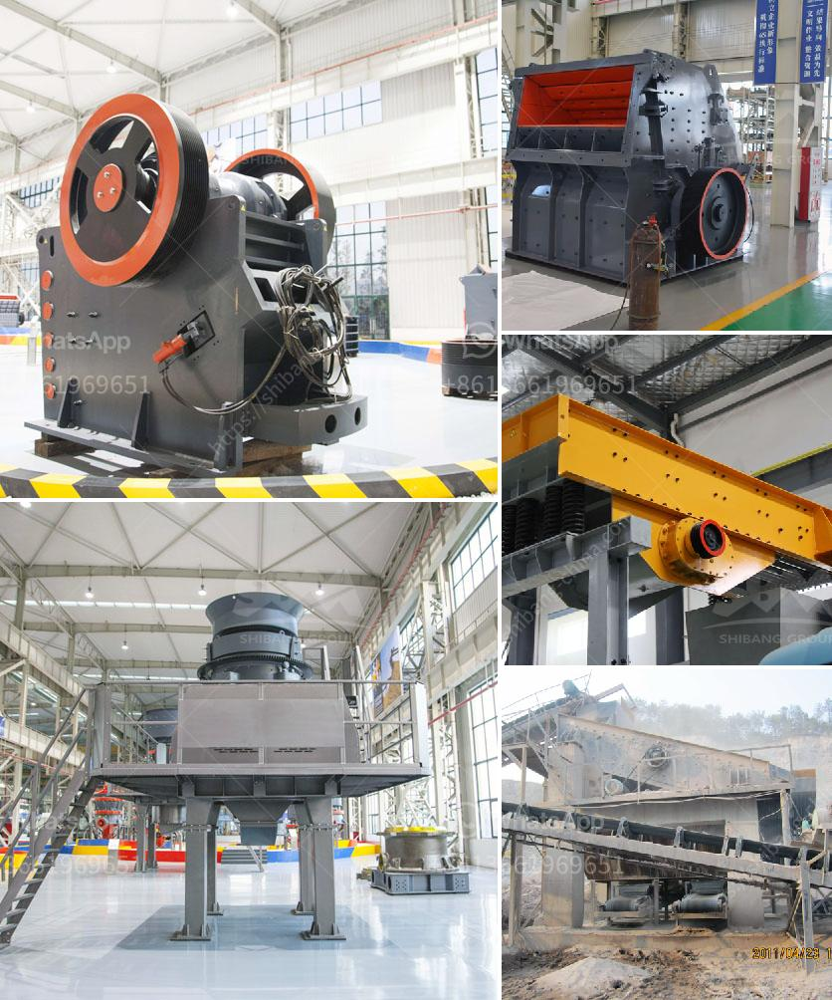

<h3>mobile stone crusher in south africa</h3>
Mobile stone crusher, also known as mobile stone crushing plant, can be regarded as a simple stone production line. The stone crushing plant can manager coarse, secondary or tertiary crushing. Fote stone crushing plant enjoys the features of reliable and convenient operation, high working efficiency and power conservation. Since the mobile stone crushing plant has good mobility, it can be moved freely according to raw material field or construction site.

Equipment in mobile stone crushing plant can freely combine together into different kinds of stone crushing plants, so as to meet demands of various raw materials. Now we have tens of thousands of users throughout China and more than 30 world markets, such as: South Africa, Middle East, India, Philippine, Western Europe, Southeastern Asia.

The stone crushers of Fote Machinery are trusted by always more South Afica customers. The stone crushers are widely used in mining, construction, stone crushing, metal ore crushing, solid waste disposal, as well as highway construction, water conservancy, refractories, sand processing and other fields. We believe that the quality and service of Fote stone crusher in South Africa will win more customers.

Mobile stone crusher for sale in south africa only can be regarded as a new type of mines crusher for sale because it has not enough market demand. So we are convinced that the mining industry in South Africa market of mobile stone crusher for sale in south africa's future is still bright and has a broad market space. At present, many manufacturers are actively involved in the construction of various types of mobile stone crushing plants. These manufacturers produce different models of mobile stone crushers to meet the demand of various customers.

Mobile stone crushers are suitable for stone an sand production. Its products' final size is small which is only 0.5-6.0mm. There are three-stage crushers which include mobile jaw crusher, mobile cone crusher, mobile impact crusher, mobile VSI sand making machine. In order to meet the customer's requirement, the engineers will equip the final products with high-quality blow bars and wear-resistant impact plates, which contribute to higher production efficiency.

In a word, mobile stone crushers can bring high benefits to users and facilitate the construction of a better future in South Africa. In recent years, the South Africa government has paid much attention to the basic infrastructure construction of their cities. Therefore, the construction industry in South Africa is booming. To meet the service demands of local users, the stone crusher manufacturers have begun to produce stone crushers specially designed for South Africa. Market of mobile stone crusher in South Africa ends successfully.
<h3>Contact us</h3><ul><li><strong>Whatsapp:&nbsp;<a href="https://wa.me/8613661969651">+8613661969651</a></strong></li><li><a href="https://swt.shibang-china.com/?git&amp;zhl&amp;mobile stone crusher in south africa"><strong>Online Service(chat now)</strong></a></li></ul><h3>Related</h3><ul><li><a href='screw feeder capacity 5 ton hour.md'>screw feeder capacity 5 ton hour</a></li><li><a href='feldspar stone crushing plant.md'>feldspar stone crushing plant</a></li><li><a href='conveyor belt manufacturer in saudi arabia.md'>conveyor belt manufacturer in saudi arabia</a></li><li><a href='quartz mining process.md'>quartz mining process</a></li><li><a href='ball mill hammer mill roller mill machine.md'>ball mill hammer mill roller mill machine</a></li></ul>