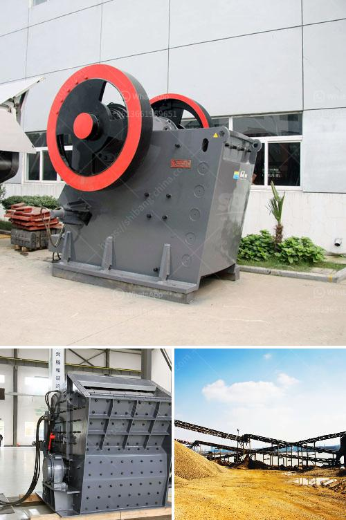

<h3>mobile stone crusher price in zimbabwe</h3>
Mobile stone crusher prices in Zimbabwe have been a topic of concern for many years not only to the mining and construction industry but also to the municipal and local authorities. The government's infrastructure development program as well as budgetary allocations for the road construction have prompted many mining companies to invest in both mobile and stationary crushing plants in Zimbabwe.

Mobile stone crusher price in Zimbabwe has a variety of configurations and models, which can meet the different crushing needs of customers. It can be equipped with jaw crusher, impact crusher, cone crusher, vibrating screen and other equipment according to the actual production requirements of customers. The mobile stone crusher price in Zimbabwe can be combined with different types of equipment to form a complete production line, including belt conveyor, vibrating feeder, vibrating screen, etc., which can meet the production needs of different users.

The market price of mobile stone crusher varies. There are many suppliers of mobile stone crusher in Zimbabwe. The price of different mobile stone crusher manufacturers, different types and models of mobile stone crushers, the output requirements and the capacity requirements are all factors that determine the price of mobile stone crusher. Some manufacturers offer a lower price for their mobile stone crushers, while others may offer higher prices. Therefore, it is important to compare the prices of different suppliers and choose the most suitable one.

Another factor that affects the mobile stone crusher price in Zimbabwe is the crusher’s technical parameters. The more advanced the technical parameters are, the higher the cost will be. Therefore, when choosing a mobile stone crusher, you should also consider the technical parameters of the equipment and choose the crusher with good quality and high performance.

In addition, the mobile stone crusher price in Zimbabwe is affected by external factors, such as exchange rate, taxation and policies, etc. Zimbabwe has a large number of gold mines, which increases the competition among mining companies. Therefore, the price of mobile stone crushers in Zimbabwe is generally lower than that of imported equipment. But this does not mean that the imported mobile stone crushers have low prices. The equipment of some well-known foreign manufacturers is more expensive due to its quality and performance advantages.

Mobile stone crusher price in Zimbabwe is also affected by the fluctuating economic environment and inflation. As a developing country with rich natural resources, Zimbabwe is prioritizing infrastructure development. Investments in road construction and other projects have continued to increase, which has further stimulated the demand for mobile stone crushers. In recent years, the cost of raw materials and labor in Zimbabwe has also increased, resulting in an increase in the price of mobile stone crushers.

In conclusion, the mobile stone crusher price in Zimbabwe is affected by a variety of factors. Different suppliers, different types of equipment, the crusher’s technical parameters, and external factors such as exchange rate and inflation all affect the price. It is important to compare the prices and quality of different suppliers when choosing a mobile stone crusher. Only by selecting a suitable and cost-effective mobile stone crusher can customers achieve the desired production goals and maximize their economic benefits.
<h3>Contact us</h3><ul><li><strong>Whatsapp:&nbsp;<a href="https://wa.me/8613661969651">+8613661969651</a></strong></li><li><a href="https://swt.shibang-china.com/?git&amp;zhl&amp;mobile stone crusher price in zimbabwe"><strong>Online Service(chat now)</strong></a></li></ul><h3>Related</h3><ul><li><a href='limestone powder making plant ireland.md'>limestone powder making plant ireland</a></li><li><a href='rotary dryer sales indonesia.md'>rotary dryer sales indonesia</a></li><li><a href='rock crushing machine suppliers.md'>rock crushing machine suppliers</a></li><li><a href='quartz mining process.md'>quartz mining process</a></li><li><a href='gravel and sand supply business plan pdf.md'>gravel and sand supply business plan pdf</a></li></ul>