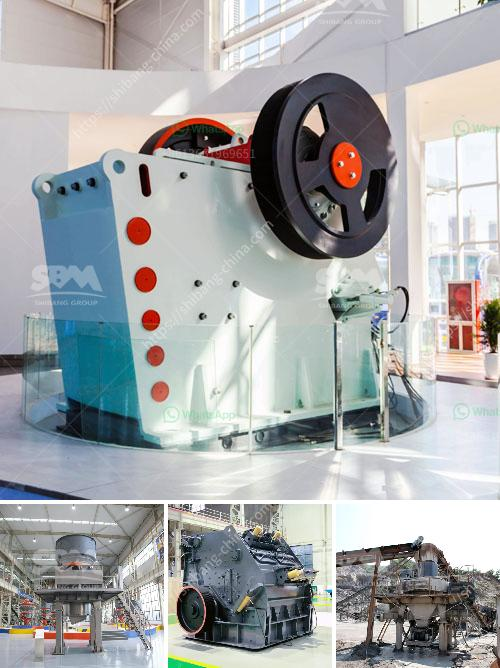

<h3>mobile vibrating screen</h3>
The mobile vibrating screen is a versatile and powerful piece of equipment that can deliver high-quality screening results. Its compact design allows it to be easily transported and deployed, making it ideal for use in various industries and applications. With its impressive capabilities, this innovative screening solution has become a valuable tool for many businesses.

One of the key advantages of the mobile vibrating screen is its flexibility. It can be used for a wide range of materials, including aggregates, minerals, and organic materials. Whether you need to screen sand, gravel, or even wood chips, this equipment can handle it with ease. This versatility makes it suitable for industries such as construction, mining, and recycling.

Efficiency is another significant feature of the mobile vibrating screen. With its high-frequency vibrations, it can effectively separate and classify particles of various sizes. The adjustable amplitude and tilt angle further enhance its screening efficiency, ensuring accurate and precise results. This efficiency can help businesses save time and money by reducing the need for manual labor and improving overall productivity.

Portability is a prominent advantage of the mobile vibrating screen. Its compact size and lightweight design allow for easy transportation and quick setup. This feature is particularly beneficial for businesses that require screening operations at different locations or on multiple job sites. The ability to move the equipment efficiently ensures maximum utilization and saves valuable resources.

Durability is a crucial consideration when investing in screening equipment, and the mobile vibrating screen does not disappoint. Built with rugged and robust materials, it is designed to withstand the harsh conditions of various work environments. Whether it's exposed to extreme temperatures, heavy loads, or abrasive materials, this equipment proves to be highly durable and long-lasting.

The mobile vibrating screen also offers user-friendly features that enhance its operation and maintenance. Its intuitive control system allows for easy adjustment of screening parameters, giving operators more control over the screening process. Additionally, its low maintenance requirements reduce downtime and ensure continuous operation, resulting in improved profitability for businesses.

In conclusion, the mobile vibrating screen is a valuable screening solution that offers versatility, efficiency, portability, and durability. It can handle a wide range of materials and deliver accurate and precise results. Whether used in construction, mining, or recycling, this equipment provides a cost-effective solution that improves productivity and profitability. Its compact design and user-friendly features make it a convenient and reliable choice for businesses operating in various industries. With the mobile vibrating screen, screening operations can be performed efficiently and effectively, leading to better quality products and enhanced customer satisfaction.
<h3>Contact us</h3><ul><li><strong>Whatsapp:&nbsp;<a href="https://wa.me/8613661969651">+8613661969651</a></strong></li><li><a href="https://swt.shibang-china.com/?git&amp;zhl&amp;mobile vibrating screen"><strong>Online Service(chat now)</strong></a></li></ul><h3>Related</h3><ul><li><a href='dolomite stone crusher plant.md'>dolomite stone crusher plant</a></li><li><a href='crusher price malaysia.md'>crusher price malaysia</a></li><li><a href='small superfine grinder price malaysia.md'>small superfine grinder price malaysia</a></li><li><a href='list of crushers companies in malaysia.md'>list of crushers companies in malaysia</a></li><li><a href='stone crushers mozambique.md'>stone crushers mozambique</a></li></ul>