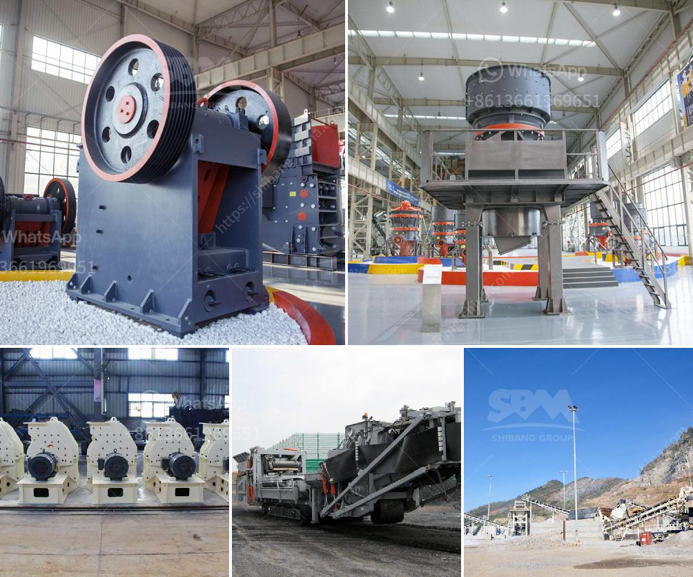

<h3>model project of soap stone powder</h3>
Soapstone, also known as steatite or soaprock, is a naturally occurring mineral that has been used for centuries in various applications. One of the most common uses of soapstone is in the manufacturing of soap stone powder, which finds numerous applications in industries such as ceramics, cosmetics, rubber, and paint.

A model project of soapstone powder involves the extraction, processing, and packaging of the mineral to meet the specific requirements of different industries. The project aims to establish a sustainable and economically viable process for the production of soapstone powder while minimizing its environmental impact.

The first step in the project is the extraction of soapstone from quarries or mines. Soapstone deposits are found in several countries, including Brazil, India, China, and the United States. The extraction process involves drilling, blasting, and removing the soapstone blocks, which are then transported to the processing facility.

Once at the processing facility, the soapstone blocks are cut into smaller pieces and crushed into a fine powder using crushers and grinding mills. The powder is then passed through sieves to remove any impurities and ensure consistent particle size. This process is crucial as it determines the quality and grade of the soapstone powder.

After the powder has been processed, it is subjected to rigorous quality control tests to ensure that it meets the required standards. These tests include checking for chemical composition, moisture content, and physical properties such as fineness, bulk density, and whiteness. Any deviations from the desired specifications are addressed before proceeding to the next step.

Once the soapstone powder has passed the quality control tests, it is ready for packaging. The powder is typically packed in bags or sacks of varying sizes, depending on the specific requirements of the end-users. Care is taken to ensure that the packaging material is of high quality and provides adequate protection during transportation and storage.

In addition to the extraction and processing aspects, the model project also focuses on sustainability and environmental conservation. Measures such as land reclamation, waste management, and water conservation are adopted to minimize the project's impact on the environment. This includes implementing eco-friendly practices such as rainwater harvesting and utilizing renewable energy sources in the manufacturing process.

Furthermore, the project prioritizes the safety and well-being of the workers involved in the extraction and processing of soapstone. Adequate safety measures are put in place, and training programs are conducted to ensure that the workers are aware of the potential risks and how to mitigate them.

The model project of soapstone powder aims to not only produce a high-quality product but also contribute to the local economy by providing employment opportunities and enhancing the livelihoods of the communities living near the soapstone deposits. By adhering to sustainable practices and maintaining strict quality control, the project strives to become a benchmark in the soapstone powder industry.

In conclusion, soapstone powder has a wide range of applications in various industries, and a model project of soapstone powder involves the extraction, processing, and packaging of the mineral. The project focuses on sustainability, environmental conservation, and the well-being of workers. By following these guidelines, the project aims to produce a high-quality product that meets industry standards while benefiting the local economy and minimizing its environmental impact.
<h3>Contact us</h3><ul><li><strong>Whatsapp:&nbsp;<a href="https://wa.me/8613661969651">+8613661969651</a></strong></li><li><a href="https://swt.shibang-china.com/?git&amp;zhl&amp;model project of soap stone powder"><strong>Online Service(chat now)</strong></a></li></ul><h3>Related</h3><ul><li><a href='aggregate production.md'>aggregate production</a></li><li><a href='crusher machine for feldspar.md'>crusher machine for feldspar</a></li><li><a href='dolamite powder machine.md'>dolamite powder machine</a></li><li><a href='feldspar milling market.md'>feldspar milling market</a></li><li><a href='small rock crushers for recreation.md'>small rock crushers for recreation</a></li></ul>