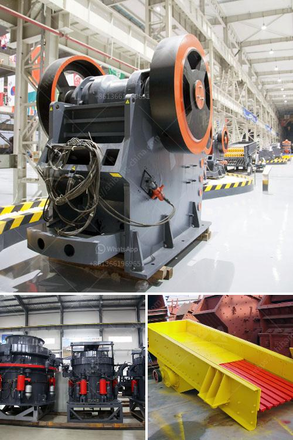

<h3>modeling clay process plant</h3>
Modeling clay, also known as plasticine or play-dough, is a versatile and easily moldable material used by artists, sculptors, and hobbyists to create three-dimensional objects. The process of creating modeling clay involves a series of steps that transform raw materials into a usable medium. In this article, we will explore the process of manufacturing modeling clay in a plant setting.

The first step in the modeling clay process plant is the formulation of the clay's ingredients. The main components of modeling clay include a binder, such as oil or wax, to give it its plasticity, and a filler material, such as flour or cornstarch, to provide bulk and reduce stickiness. Additional ingredients such as pigments, fragrances, and preservatives may be added to enhance the clay's properties or aesthetic appeal.

Once the ingredients are determined, they are carefully measured and mixed in large processing equipment. The mixing process ensures that the ingredients are evenly distributed and form a homogeneous mixture. High-quality clay requires precise measurements and thorough mixing to achieve the desired consistency and color.

After the mixing process, the clay mixture is transferred to a kneading machine. This machine applies pressure and mechanical action to further blend and smoothen the clay. The kneading process not only enhances the plasticity and malleability of the clay but also removes any air bubbles or imperfections generated during mixing.

Next, the kneaded clay is shaped into desired forms through extrusion or molding. Extrusion involves passing the clay mixture through an extruder machine, which presses it through a die to produce long ribbons or ropes of clay with a consistent cross-section. The extruded clay can then be cut into smaller lengths for packaging or further processing.

Alternatively, molding can be employed to create customized shapes and designs. This process involves using molds or presses to shape the clay into specific forms. The molds can be made of various materials, such as silicone or metal, depending on the complexity and size of the desired objects. Molding allows for greater precision and replication of intricate details in the final products.

Once the clay has been extruded or molded, it undergoes a drying process to remove moisture and facilitate its hardening. This can be done through air drying or using an industrial oven or kiln. The drying process must be carefully controlled to prevent cracking or warping of the clay. After drying, the clay becomes firm and holds its shape, ready for use.

Finally, the dried clay is packaged, labeled, and prepared for distribution. Depending on the intended market and customer preferences, the clay may be provided in various sizes, colors, and packaging formats, such as tubs, blocks, or individual portions. Proper labeling ensures that consumers are aware of the clay's properties, usage instructions, and safety precautions.

In conclusion, the process of manufacturing modeling clay in a plant setting involves several critical steps, including ingredient formulation, mixing, kneading, shaping, drying, and packaging. Each step requires careful attention to detail and quality control to produce a high-quality and user-friendly product. By following these processes and utilizing advanced equipment, modeling clay plants can ensure the production of a versatile and loved material for creative expression and artistic endeavors.
<h3>Contact us</h3><ul><li><strong>Whatsapp:&nbsp;<a href="https://wa.me/8613661969651">+8613661969651</a></strong></li><li><a href="https://swt.shibang-china.com/?git&amp;zhl&amp;modeling clay process plant"><strong>Online Service(chat now)</strong></a></li></ul><h3>Related</h3><ul><li><a href='limestone vertical mill.md'>limestone vertical mill</a></li><li><a href='mobile crusher malaysia for sell.md'>mobile crusher malaysia for sell</a></li><li><a href='crushing plant thailand.md'>crushing plant thailand</a></li><li><a href='china quarrying machine prices china.md'>china quarrying machine prices china</a></li><li><a href='design drawing of hopper for crusher.md'>design drawing of hopper for crusher</a></li></ul>