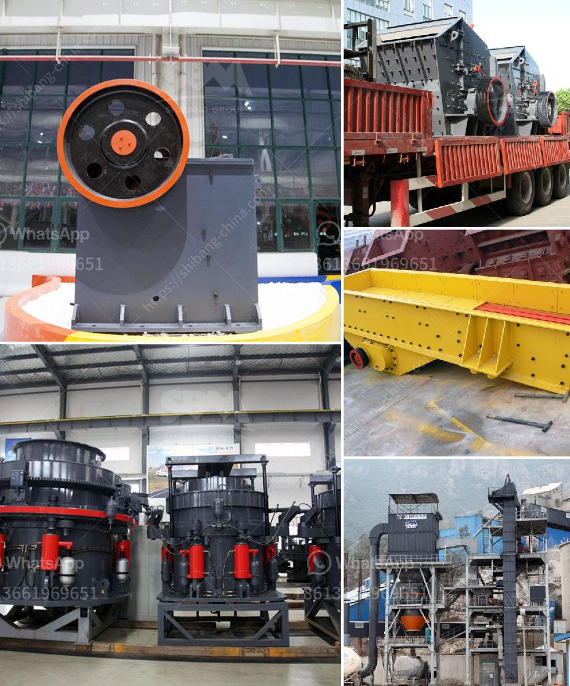

<h3>models of stone crushers in malaysia</h3>
Stone crushers are a crucial part of the mining and construction industry in Malaysia. They break down large rocks into smaller pieces, making it easier to transport or use them for various purposes. With the growing demand for aggregates and construction materials, the need for efficient and reliable stone crushers has never been higher. In this article, we will discuss some of the popular models of stone crushers in Malaysia and their unique features.

Jaw crushers are widely used in the mining and construction industry as a primary stone crusher. They are designed to crush hard materials, such as granite, basalt, and limestone, into smaller particles. Jaw crushers have a straightforward design, with a fixed jaw plate and a movable jaw plate. The material is fed into the crushing chamber and is crushed by the continuous movement of the jaws.

Cone crushers are another popular choice for stone crushing in Malaysia. They are often used as secondary or tertiary crushers, capable of producing a high-quality end product. Cone crushers work by squeezing the material between an eccentrically rotating mantle and a concave hopper. This action creates a compressive force that breaks the rocks into smaller sizes.

Impact crushers are versatile machines used for primary or secondary crushing. They utilize the principle of impact to break down rocks. The material is accelerated into a rotor, where it is crushed upon impact. Impact crushers are known for their high reduction ratios and excellent particle shape. They are suitable for various types of rocks, including soft and hard materials.

Mobile crushers have gained significant popularity in recent years due to their flexibility and convenience. These crushers are mounted on a movable chassis, allowing them to be easily transported to different job sites. Mobile crushers can be categorized into jaw crushers, cone crushers, or impact crushers, depending on the type of crusher mounted on the chassis. They are widely used in construction sites, quarry operations, and mining projects.

Portable crushers are similar to mobile crushers but are typically smaller in size and designed for specific applications. They offer the advantage of being easily transported from one location to another. Portable crushers are commonly used in small-scale mining or construction projects, where mobility is essential. They are available in various sizes and can be customized to meet specific requirements.

In conclusion, stone crushers play a vital role in Malaysia's mining and construction industry. These powerful machines break down large rocks into smaller particles, making them easier to transport and process. The choice of stone crusher depends on the specific requirements of the project, including the type of rock, desired product size, and mobility requirements. Jaw crushers, cone crushers, and impact crushers are commonly used options, while mobile and portable crushers offer flexibility and convenience. With a wide range of models available, Malaysia's stone crusher market provides choices for various industries and applications.
<h3>Contact us</h3><ul><li><strong>Whatsapp:&nbsp;<a href="https://wa.me/8613661969651">+8613661969651</a></strong></li><li><a href="https://swt.shibang-china.com/?git&amp;zhl&amp;models of stone crushers in malaysia"><strong>Online Service(chat now)</strong></a></li></ul><h3>Related</h3><ul><li><a href='double roll rollers.md'>double roll rollers</a></li><li><a href='gold washing plant colombia.md'>gold washing plant colombia</a></li><li><a href='china crusher manufacturer.md'>china crusher manufacturer</a></li><li><a href='jaw rock crusher price by owner.md'>jaw rock crusher price by owner</a></li><li><a href='mini cement plant project cost.md'>mini cement plant project cost</a></li></ul>