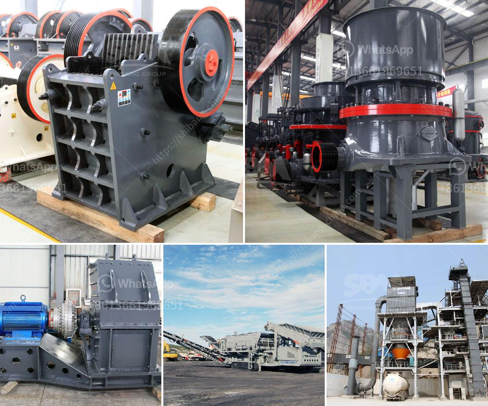

<h3>movable conveyor belt</h3>
The advancement in technology has brought numerous improvements in various industries, one of which is the development of the movable conveyor belt. A movable conveyor belt, also known as a portable conveyor belt, is a flexible and efficient tool designed to transport goods and materials from one location to another.

One of the notable advantages of a movable conveyor belt is its versatility. Unlike traditional conveyor belts that are fixed in one place, these portable belts can be easily moved and adjusted to different positions and heights. This flexibility enables industries to optimize their workflow and maximize productivity by transferring goods seamlessly between different areas in their facility.

In addition to their mobility, movable conveyor belts also offer the convenience of quick installation and setup. Unlike permanent conveyor belts that require significant time and effort for installation and integration into existing systems, portable belts can be easily assembled and put into operation within a short period. This allows industries to adapt to changing production demands and integrate these belts into their processes effortlessly.

Furthermore, these movable conveyor belts are designed with durability and reliability in mind. They are constructed using high-quality materials that can withstand heavy loads and harsh working conditions. This ensures that industries can rely on these belts to consistently transport goods without any disruptions or breakdowns, increasing operational efficiency and reducing downtime.

The applications for movable conveyor belts are extensive. From warehouses and distribution centers to manufacturing facilities and construction sites, these portable belts can be used in various industries. They are commonly employed for loading and unloading trucks, sorting and segregating items, and even for assembly line processes, significantly improving operational efficiency and reducing manual labor.

To conclude, the introduction of movable conveyor belts has revolutionized the way industries transport goods and materials. Their flexibility, quick setup, durability, and adaptability to various applications make them an invaluable tool in optimizing workflow and enhancing productivity. As industries continue to seek ways to streamline their operations, movable conveyor belts are anticipated to play an increasingly crucial role in their success.
<h3>Contact us</h3><ul><li><strong>Whatsapp:&nbsp;<a href="https://wa.me/8613661969651">+8613661969651</a></strong></li><li><a href="https://swt.shibang-china.com/?git&amp;zhl&amp;movable conveyor belt"><strong>Online Service(chat now)</strong></a></li></ul><h3>Related</h3><ul><li><a href='rock crushing machine suppliers.md'>rock crushing machine suppliers</a></li><li><a href='bal mill snsttlled capacity.md'>bal mill snsttlled capacity</a></li><li><a href='africa sand washing plant for rent and sale.md'>africa sand washing plant for rent and sale</a></li><li><a href='laying of conveyor belting.md'>laying of conveyor belting</a></li><li><a href='crusher unit price.md'>crusher unit price</a></li></ul>