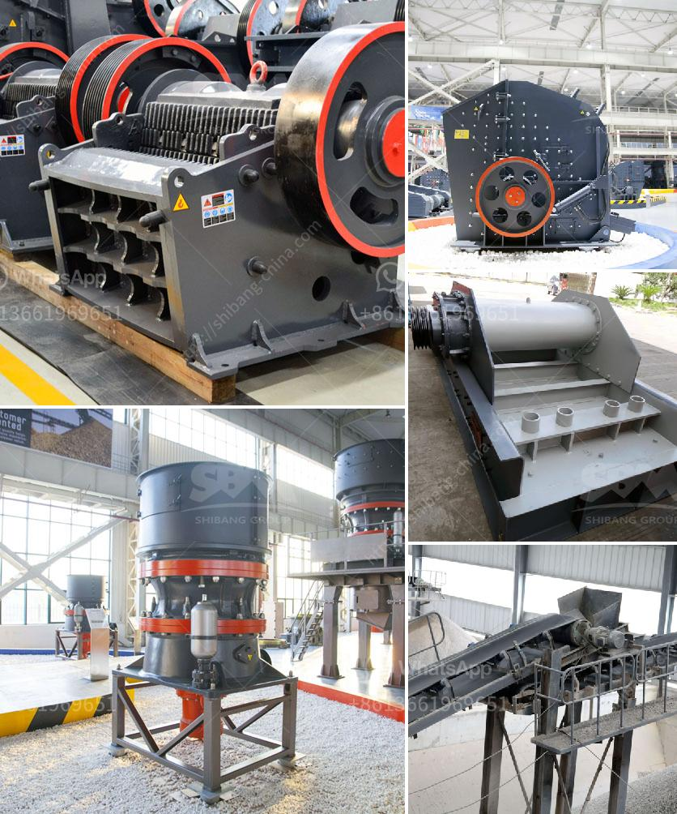

<h3>movable gravel crusher</h3>
The construction industry heavily relies on the use of various types of aggregate materials such as gravel, sand, and crushed stone. These materials serve as key ingredients in producing concrete, asphalt, and other building materials. To obtain these materials, construction companies often utilize gravel crushers, which break down large stones or rocks into smaller, easily transportable pieces. One such innovation in the field is the development of movable gravel crushers, which have revolutionized the crushing process in construction sites.

A movable gravel crusher is a machine that temporarily crushes large-sized rocks into smaller pieces. The mobility of these machines enables operators to easily transport them to different locations, thus reducing the need for a stationary crushing plant. This makes it suitable for various construction projects that require on-site crushing, including road construction, demolition, and site development.

One of the notable advantages of a movable gravel crusher is its ability to enhance operational efficiency. By eliminating the need to transport rocks or stones to a fixed crusher, construction companies can significantly reduce transportation costs and save time. This is particularly advantageous when working on remote sites or projects with tight schedules.

Additionally, a movable gravel crusher allows operators to quickly switch between different crushing sites. Instead of having a dedicated crushing plant for every site, construction companies can utilize a single machine and move it as needed. This versatility not only reduces costs but also improves productivity by minimizing downtime between projects.

Furthermore, a movable gravel crusher is able to crush rocks or stones directly at the construction site, eliminating the need for intermediate stockpiling. This not only reduces the risk of material contamination but also saves space. Construction companies can make better use of limited workspace by avoiding the need for additional stockpiling areas.

In terms of environmental impact, a movable gravel crusher also offers several advantages. Traditional fixed crushers often require a significant amount of dust suppression measures, such as water sprays, to control airborne particles during the crushing process. However, a movable gravel crusher typically incorporates built-in dust suppression systems that minimize the release of dust into the surrounding environment, thus promoting a healthier and safer working environment.

Moreover, a movable gravel crusher can also contribute to the sustainability of construction projects. By reducing the need for transporting materials and eliminating the need for intermediate stockpiling, these machines help to reduce carbon emissions associated with construction activities. This aligns with the industry's growing focus on environmental sustainability and responsible construction practices.

In conclusion, the development of movable gravel crushers has significantly transformed the construction industry. These machines offer enhanced operational efficiency, reduced transportation costs, increased versatility, and improved environmental impact. As construction companies continue to adopt innovative solutions and technologies, the utilization of movable gravel crushers is expected to become increasingly common, helping to streamline construction processes and promote sustainable development.
<h3>Contact us</h3><ul><li><strong>Whatsapp:&nbsp;<a href="https://wa.me/8613661969651">+8613661969651</a></strong></li><li><a href="https://swt.shibang-china.com/?git&amp;zhl&amp;movable gravel crusher"><strong>Online Service(chat now)</strong></a></li></ul><h3>Related</h3><ul><li><a href='quartz ball mills hyderabad.md'>quartz ball mills hyderabad</a></li><li><a href='mobile crushing and screening.md'>mobile crushing and screening</a></li><li><a href='principle of roller mill.md'>principle of roller mill</a></li><li><a href='write an article about cube crushing machine for concrete with 100300 words.md'>write an article about cube crushing machine for concrete with 100-300 words</a></li><li><a href='calcite powder machine.md'>calcite powder machine</a></li></ul>