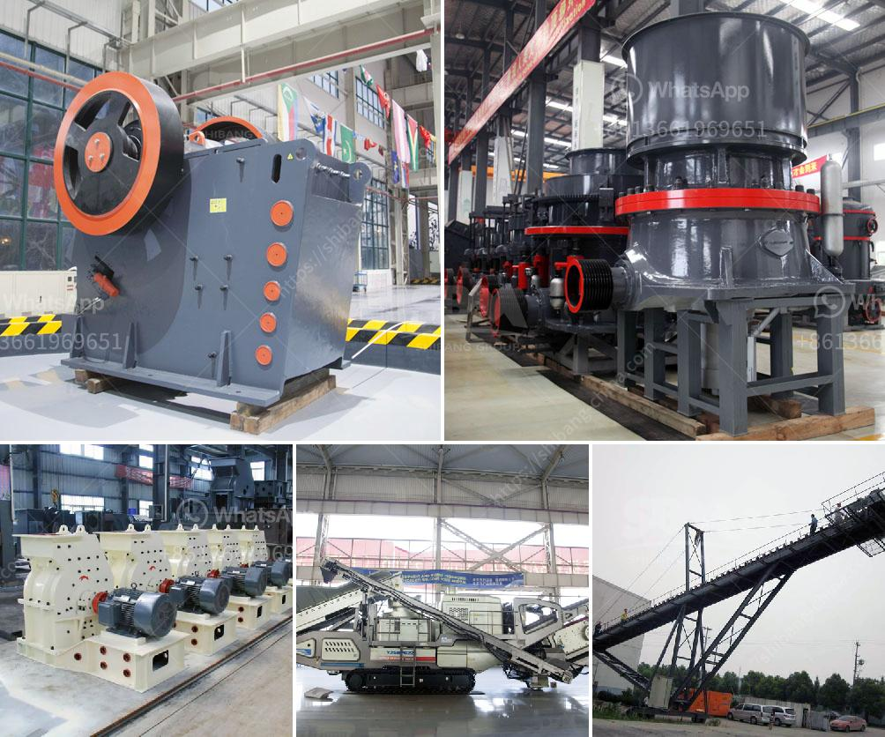

<h3>movable stone crusher</h3>
The portable stone crusher, which integrates the feeding, crushing and conveying systems, can crush rocks with a hardness of over 300 MPa into gravel-sized particles, making it an ideal choice for crushing raw materials such as granite, river pebble, limestone, basalt, shale, etc. Under the pressure of environmental protection and sustainable development, crushing equipment has undergone major changes and upgrades. With its various advantages, the portable stone crusher has become a popular and widely used crushing equipment.

Firstly, the integration of the entire unit eliminates the need for complex site infrastructure construction, which greatly reduces the installation time and cost of the equipment. Compared with traditional fixed crushers, portable stone crushers can be used directly on the site without being transported to another location. This not only saves transportation costs but also reduces the pollution caused by dust and noise during transportation.

Secondly, the portable stone crusher is equipped with a high-quality crushing cavity, which greatly improves the crushing efficiency. The stone crusher adopts innovative technology to develop a new type of crushing equipment with better technology and performance. The crushing capacity has been greatly improved, which significantly improves the output of the equipment.

Thirdly, the portable stone crusher can move freely, allowing for a higher flexibility and adaptability to various working environments. In addition, the system configuration is reasonable, so it greatly reduces the cost of materials transportation.

Moreover, the portable stone crusher is powered by a diesel engine, which means it has great adaptability to the working site. From the shipyard to the job site, the electric drive solution minimizes emissions and maximizes energy efficiency. Moreover, it eliminates the need for expensive infrastructure – power lines, transformers, substations, etc., which further reduces operating costs.

Furthermore, the portable stone crusher has the advantage of low investment cost and high economic benefits. Compared with the fixed crushers, the mobile crusher station is less affected by the infrastructure construction, ensuring the stable operation of the equipment and reducing the cost of investment. Moreover, the portable stone crusher can crush materials on-site, avoiding the intermediate links of re-crushing and transporting, which saves a large amount of transportation costs.

In conclusion, the portable stone crusher has become an essential equipment in mining, metallurgy, construction, power, railway, water conservancy, and many other industries. It is flexible, efficient, and moves freely, making it an indispensable crushing device in the mining, construction, and engineering industries. With its advantages in crushing efficiency, mobility, and economy, the portable stone crusher will open up a new era of mining and quarrying industry.
<h3>Contact us</h3><ul><li><strong>Whatsapp:&nbsp;<a href="https://wa.me/8613661969651">+8613661969651</a></strong></li><li><a href="https://swt.shibang-china.com/?git&amp;zhl&amp;movable stone crusher"><strong>Online Service(chat now)</strong></a></li></ul><h3>Related</h3><ul><li><a href='jaw crusher price.md'>jaw crusher price</a></li><li><a href='quarry crusher cost.md'>quarry crusher cost</a></li><li><a href='land rock crusher sale.md'>land rock crusher sale</a></li><li><a href='mill manufactures of hammer aryesanal.md'>mill manufactures of hammer aryesanal</a></li><li><a href='industrial ball mills.md'>industrial ball mills</a></li></ul>