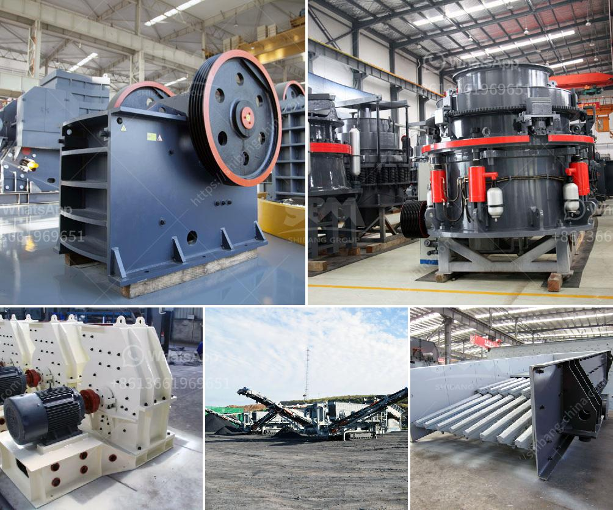

<h3>nepal jaw crusher or sale</h3>
Nepal is known for its rich cultural heritage, diverse geography, and the birthplace of Lord Buddha. It is also one of the fastest-growing economies in the world, driven by sectors such as agriculture, tourism, and hydropower.

In recent years, Nepal has witnessed rapid urbanization, with many infrastructure projects in the pipeline. The construction industry, in particular, has seen significant growth, creating a demand for various construction equipment. One such equipment is the jaw crusher, widely used in the construction industry.

A jaw crusher is a machine that utilizes the compression force to break down materials. It is designed to reduce large rocks into smaller rocks or gravel. Generally, the jaw crusher consists of a fixed jaw plate and a movable jaw plate. The movable jaw plate exerts force on the rock by pressing it against the fixed jaw plate, which causes it to break.

The jaw crusher is an essential piece of equipment when you are in the construction industry. It is versatile and can handle any type of material, such as granite, limestone, concrete, and even asphalt. Its rugged construction ensures it can withstand the harshest operating conditions, making it perfect for use in Nepal's diverse terrain.

When it comes to shopping for a jaw crusher in Nepal, the market is flooded with various options. However, it is important to choose a reputable and reliable manufacturer or supplier. The quality of the jaw crusher directly affects its performance and durability. Investing in a high-quality jaw crusher ensures long-term benefits, such as reduced downtime and maintenance costs.

Moreover, the size and capacity of the jaw crusher are crucial factors to consider. Depending on the specific requirements of the project, the size and capacity of the jaw crusher must match. For instance, if the project involves breaking down large rocks, a jaw crusher with a higher capacity would be more suitable.

Another important consideration is the cost of the jaw crusher. While the price may vary depending on factors such as brand and specifications, it is important to strike a balance between quality and affordability. Investing in a reliable jaw crusher that offers value for money is essential.

Additionally, after-sales service and support play a significant role in the overall customer experience. A manufacturer or supplier that provides excellent after-sales service, including technical assistance, spare parts availability, and warranty coverage, can make all the difference. It ensures that the jaw crusher remains operational efficiently and minimizes any potential downtime.

In conclusion, the demand for a jaw crusher in Nepal's construction industry is on the rise due to rapid urbanization and infrastructure development. Choosing a high-quality and reliable jaw crusher from a reputable manufacturer or supplier is crucial for optimum performance and long-term benefits. With the right jaw crusher, construction projects in Nepal can be completed swiftly and efficiently, contributing to the overall growth of the country's economy.
<h3>Contact us</h3><ul><li><strong>Whatsapp:&nbsp;<a href="https://wa.me/8613661969651">+8613661969651</a></strong></li><li><a href="https://swt.shibang-china.com/?git&amp;zhl&amp;nepal jaw crusher or sale"><strong>Online Service(chat now)</strong></a></li></ul><h3>Related</h3><ul><li><a href='used small gold processing plant from dubai.md'>used small gold processing plant from dubai</a></li><li><a href='chrome mining equipment and machinery.md'>chrome mining equipment and machinery</a></li><li><a href='jaw crusher design handbook.md'>jaw crusher design handbook</a></li><li><a href='limestone crushing plant.md'>limestone crushing plant</a></li><li><a href='belt conveyor belt suppliers in oman.md'>belt conveyor belt suppliers in oman</a></li></ul>