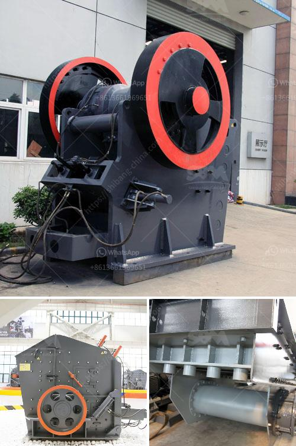

<h3>netherland ore processing and crusher company</h3>
The Netherlands, known for its vibrant economy, advanced infrastructure, and proactive business environment, has emerged as a hub for global ore processing and crusher companies. Among the prominent players in this sector is a leading Netherlands-based manufacturer that has been offering its innovative solutions to the international market.

With an illustrious history spanning several decades, this Netherlands ore processing and crusher company has consistently showcased its commitment to providing cutting-edge technology and delivering superior products. Equipped with state-of-the-art facilities and an experienced team, the company has become a trusted name in the industry.

One of the key factors contributing to the company's success is its relentless focus on research and development. By investing heavily in innovation, the Netherlands ore processing and crusher company has been able to introduce groundbreaking techniques that enhance productivity, efficiency, and sustainability. These advancements have helped the company cater effectively to the ever-evolving demands of its global clientele.

The company's robust ore processing and crusher equipment offer a wide range of capabilities, facilitating the extraction and refining of various minerals with maximum efficiency. Its crushers, grinders, concentrators, and other processing units can handle a diverse range of ores, ensuring optimal output.

Moreover, the Netherlands ore processing and crusher company stands out with its commitment to sustainability. Conscious of the environmental impact of extraction and processing, the company has incorporated green technologies and techniques into its operations. This includes utilizing renewable energy sources, implementing water recycling and purification systems, and minimizing waste generation. By adopting such sustainable practices, the company demonstrates its dedication to responsible mining and environmental stewardship.

The successful track record of the Netherlands ore processing and crusher company is reflected in its global customer base and partnerships with leading mining entities worldwide. Through its reliable products, exceptional customer service, and continuous drive for excellence, the company has earned the trust and loyalty of clients across the globe.

In conclusion, the Netherlands ore processing and crusher company is a shining example of the country's prowess in the mining and processing sector. By combining technological innovation, sustainable practices, and a customer-centric approach, the company has positioned itself as a frontrunner in the global market. With its unwavering commitment to quality and progress, it is well-equipped to meet the ever-growing demands of the industry and contribute to its sustainable development.
<h3>Contact us</h3><ul><li><strong>Whatsapp:&nbsp;<a href="https://wa.me/8613661969651">+8613661969651</a></strong></li><li><a href="https://swt.shibang-china.com/?git&amp;zhl&amp;netherland ore processing and crusher company"><strong>Online Service(chat now)</strong></a></li></ul><h3>Related</h3><ul><li><a href='crushing machine manufacturers cape town.md'>crushing machine manufacturers cape town</a></li><li><a href='gold sand processing technology.md'>gold sand processing technology</a></li><li><a href='used ball mill for sale india.md'>used ball mill for sale india</a></li><li><a href='crushing equipment south africa crusher quotes.md'>crushing equipment south africa crusher quotes</a></li><li><a href='used marble machinery turkey.md'>used marble machinery turkey</a></li></ul>