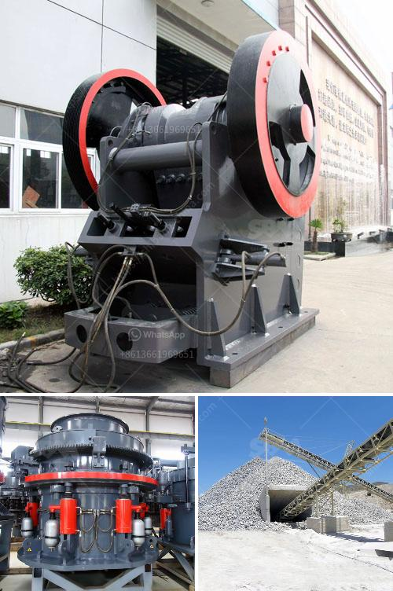

<h3>nigeria hammer mill</h3>
The hammer mill is a machine designed to crush or pulverize materials and turn them into smaller particles. It is used in various industries, from pharmaceuticals to food and feed processing.

Nigeria is undoubtedly a country endowed with numerous agricultural resources that can help achieve self-sufficiency and economic growth. One of such is the hammer mill, which is commonly used for milling grains in the country.

In Nigeria, hammer mills are mainly used in fish farming, poultry farming, and cassava processing industries. In the fish farming industry, hammer mills are used to grind down the dried fish, as well as other fish waste, to a desired particle size suitable for fish feed production. Similarly, in the poultry industry, hammer mills are used to grind down the dried poultry waste and mix it with other ingredients to produce poultry feed.

The hammer mill is also extensively used in the cassava processing industry, especially in rural areas where power supply is limited. Farmers can easily process their harvested cassava into flour using the hammer mill. This helps to reduce post-harvest losses and increase the shelf life of the cassava.

One of the advantages of using the hammer mill is its ability to produce a wide range of particle sizes. This is achieved by varying the screen size through which the milled particles pass. This flexibility allows farmers and processors to produce different types and grades of products, depending on the market demand.

The hammer mill is also cost-effective, especially for small-scale farmers or processors. The initial investment in acquiring a hammer mill is relatively low compared to other processing equipment. Additionally, the operational costs such as maintenance and power consumption are also minimal.

However, there are some challenges associated with the use of hammer mills in Nigeria. One of the challenges is the availability of spare parts. Most of the hammer mills used in Nigeria are imported, and they often lack the necessary spare parts, making maintenance difficult. This can result in prolonged downtime, impacting productivity and profitability.

Another challenge is the issue of power supply. Nigeria, like many other African countries, faces frequent power outages. The hammer mill relies on electricity to function, and these power outages can disrupt production and lead to financial losses.

Despite these challenges, the hammer mill remains a vital machine in Nigeria, ensuring the availability of affordable and nutritious feeds for livestock and poultry. It also enables small-scale farmers and processors to add value to their agricultural produce, thereby contributing to poverty reduction and economic growth.

In conclusion, the hammer mill is an essential machine in Nigeria, used in various industries to crush or pulverize materials and turn them into smaller particles. It is cost-effective, flexible in producing different particle sizes, and contributes to agricultural value addition and economic growth. However, challenges such as spare parts availability and power supply need to be addressed to ensure its optimal utilization in the country.
<h3>Contact us</h3><ul><li><strong>Whatsapp:&nbsp;<a href="https://wa.me/8613661969651">+8613661969651</a></strong></li><li><a href="https://swt.shibang-china.com/?git&amp;zhl&amp;nigeria hammer mill"><strong>Online Service(chat now)</strong></a></li></ul><h3>Related</h3><ul><li><a href='sand washing plant south africa.md'>sand washing plant south africa</a></li><li><a href='coal crushing and washing plant for sale south africa.md'>coal crushing and washing plant for sale south africa</a></li><li><a href='used raymond grinding mill sale in pakistan.md'>used raymond grinding mill sale in pakistan</a></li><li><a href='manufacturer of limestone process.md'>manufacturer of limestone process</a></li><li><a href='roller crusher on sale.md'>roller crusher on sale</a></li></ul>