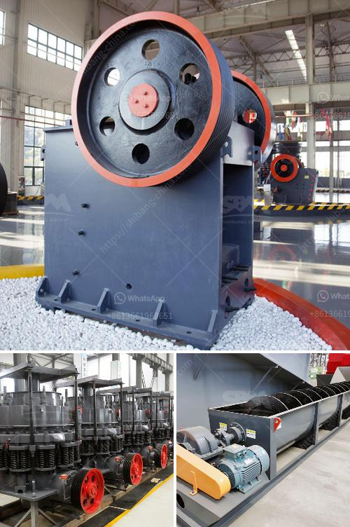

<h3>nigeria jaw crusher</h3>
Nigeria Jaw Crusher is designed to break down big rocks into manageable particles that can be fed into secondary and tertiary crushing plants. Since its inception, a jaw crusher has been an essential part of the construction industry, and it is widely used in a variety of applications such as mining, metallurgy, building materials, and industries that require the crushing of hard rocks and ore.

The Nigeria Jaw Crusher is a new generation of crushing machinery manufactured by Henan Fote Heavy Machinery Co., Ltd. It is characterized by large crushing ratio, high production capacity, low energy consumption, simple structure, easy operation and maintenance, and stable performance. This jaw crusher is an indispensable equipment in the crushing process, and it is widely used in various materials processing and mining fields.

One of the notable features of the Nigerian Jaw Crusher is its capability to handle a wide range of materials. This crusher is designed to crush even the hardest of materials, such as granite, basalt, limestone, quartz, concrete, iron ore, and other ores. Its versatility makes it suitable for various applications, including mining, construction, and recycling.

Another advantage of the Nigeria Jaw Crusher is its efficient and low-cost operation. The crusher uses a fixed jaw plate and a moving one to create a compressive force. This force breaks down the material into smaller particles, which are then discharged through the bottom opening. The low energy consumption of the jaw crusher makes it environmentally friendly, reducing the carbon footprint and operating costs.

Maintenance is also a breeze with the Nigeria Jaw Crusher. The design of the crusher allows for easy access to the jaw plates, reducing downtime. The jaw plates are made of durable materials, ensuring a longer lifespan for the crusher. Additionally, the crusher is equipped with a hydraulic system for easy adjustment of the crusher's closed side setting. This enables operators to adjust the size of the output, improving overall productivity.

The Nigeria Jaw Crusher is also equipped with safety features to ensure the well-being of operators. A protective guard covers the moving parts of the crusher, preventing any accidents during operation. Additionally, the crusher is designed with a reliable overload protection system, which automatically shuts down the crusher in case of an overload, preventing damage to the crusher and increasing its lifespan.

In conclusion, the Nigeria Jaw Crusher is a game-changer in the crushing industry. Its modern design, advanced technology, and cost-effective operation make it a reliable and efficient choice for any crushing application. Whether it is used in mining, construction, or recycling, this jaw crusher is capable of handling any material with ease. With its impressive performance and durability, the Nigeria Jaw Crusher is set to revolutionize the crushing technology and become a staple in the construction industry in Nigeria and beyond.
<h3>Contact us</h3><ul><li><strong>Whatsapp:&nbsp;<a href="https://wa.me/8613661969651">+8613661969651</a></strong></li><li><a href="https://swt.shibang-china.com/?git&amp;zhl&amp;nigeria jaw crusher"><strong>Online Service(chat now)</strong></a></li></ul><h3>Related</h3><ul><li><a href='quartz crusher plant manufacturers in india.md'>quartz crusher plant manufacturers in india</a></li><li><a href='land rock crusher sale.md'>land rock crusher sale</a></li><li><a href='vibrating feeder screen.md'>vibrating feeder screen</a></li><li><a href='manganese crusher processing plant in india.md'>manganese crusher processing plant in india</a></li><li><a href='used mobile coal screening plants.md'>used mobile coal screening plants</a></li></ul>