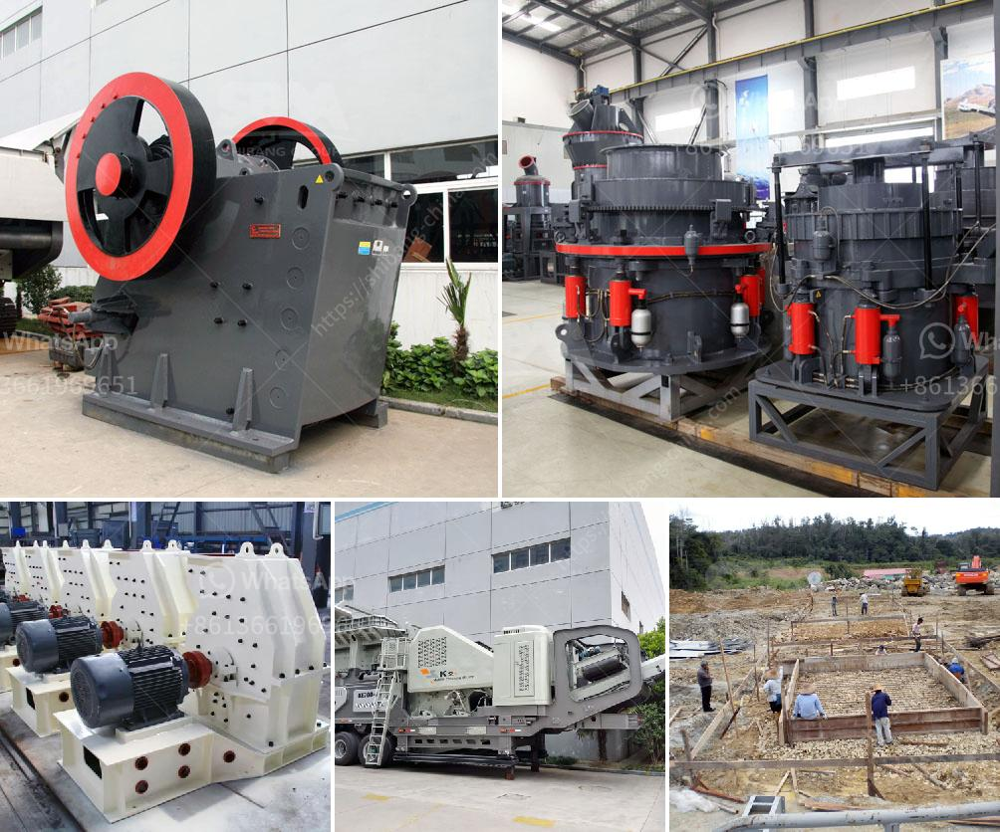

<h3>nigeria portable crushers</h3>
In recent years, Nigeria has been facing various infrastructure challenges due to its rapidly growing population and expanding economy. One of the major challenges is the lack of quality roads and transportation networks, particularly in remote areas where natural resources are abundant. Nigeria portable crushers have therefore become a crucial consideration for many construction and mining companies.

Portable crushers are designed to break down large rocks into smaller, more manageable pieces. They are widely used in the construction and mining industries for various crushing purposes such as stone quarries, recycling plants, and construction waste disposal sites. Unlike traditional crushers, portable crushers can be easily transported from one site to another, making them highly versatile and efficient.

One of the key benefits of Nigeria portable crushers is their ability to save time and money on transportation costs. With the traditional approach, large rocks need to be transported from quarries or mining sites to the processing plants or construction sites. This process can be expensive and time-consuming, especially in remote areas with poor infrastructure. Portable crushers eliminate the need for such transportation, as they can be set up directly at the source of the material. This not only reduces transportation costs but also saves valuable time, enabling companies to complete projects faster.

Furthermore, Nigeria portable crushers can improve the overall efficiency of construction and mining operations. By breaking down large rocks into smaller pieces at the source, portable crushers eliminate the need for additional crushing and screening processes. This reduces the overall processing time and cost, while also minimizing the risk of material losses or contamination during transportation. Additionally, portable crushers can be equipped with advanced features such as electronic control systems, adjustable settings, and high-capacity feeders, further enhancing their productivity and efficiency.

The versatility of Nigeria portable crushers is another significant advantage. They can be used for various types of materials ranging from limestone and granite to concrete and asphalt. This makes them suitable for a wide range of applications in the construction and mining industries. For example, portable crushers can be used to produce aggregates for road construction, fill material for land reclamation, or even recycled materials for environmental sustainability.

However, it is essential to consider certain factors when choosing Nigeria portable crushers. Firstly, the size and capacity of the crushers should be compatible with the specific requirements of the project. Secondly, the crushers should be durable and reliable to withstand the harsh conditions often encountered in construction and mining sites. Lastly, it is crucial to ensure that the portable crushers comply with local environmental regulations to minimize any adverse impact on the surroundings.

In conclusion, Nigeria portable crushers have emerged as a viable solution for crushing challenges in the country. Their ability to save transportation costs, improve efficiency, and offer versatility makes them indispensable for construction and mining companies. With the growing demand for infrastructure development, portable crushers are expected to play a crucial role in Nigeria's journey towards economic growth and development.
<h3>Contact us</h3><ul><li><strong>Whatsapp:&nbsp;<a href="https://wa.me/8613661969651">+8613661969651</a></strong></li><li><a href="https://swt.shibang-china.com/?git&amp;zhl&amp;nigeria portable crushers"><strong>Online Service(chat now)</strong></a></li></ul><h3>Related</h3><ul><li><a href='granite quarry business plan pdf.md'>granite quarry business plan pdf</a></li><li><a href='coal mill in malaysia.md'>coal mill in malaysia</a></li><li><a href='dry grinding ball mill.md'>dry grinding ball mill</a></li><li><a href='granulator jaw crusher hadfield.md'>granulator jaw crusher hadfield</a></li><li><a href='stone crushers made in greece.md'>stone crushers made in greece</a></li></ul>