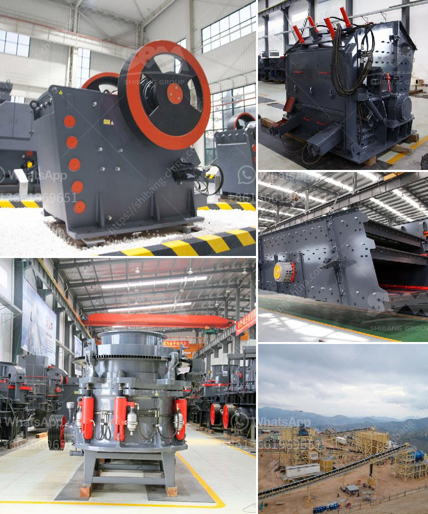

<h3>nirani cement plant</h3>
The Nirani Cement plant, also known as the Nirani Sugars Limited Cement Division, is a prominent cement production facility located in the Bagalkot district of Karnataka, India. Established in 2009, the plant is a venture by the Nirani Group, a well-known industrial conglomerate with interests in various sectors.

Spread over an expansive area of land, the Nirani Cement plant employs advanced technology and modern machinery to produce high-quality cement. With an annual production capacity of over one million tons, the facility plays a crucial role in meeting the growing demand for cement in the region. The plant primarily focuses on the production of Ordinary Portland Cement (OPC) and Portland Pozzolana Cement (PPC) that are widely used in construction activities.

One of the key features of the Nirani Cement plant is its commitment to sustainability. The facility is equipped with advanced pollution control systems that minimize its environmental impact. Effluent treatment plants ensure the responsible management of industrial waste, while measures like rainwater harvesting help conserve water resources. Additionally, the plant utilizes alternative fuels like biomass and waste-derived fuels, reducing reliance on fossil fuels and contributing to a greener environment.

The localization of the plant in the Bagalkot district has brought significant socio-economic benefits to the region. The establishment of the cement plant has created numerous job opportunities, providing employment to hundreds of local residents. This has not only reduced the unemployment rate in the area but also improved the standard of living for the individuals and their families.

Furthermore, the Nirani Cement plant has actively engaged in various corporate social responsibility (CSR) initiatives to uplift the nearby communities. The organization regularly conducts health camps, providing free medical check-ups and treatment to underprivileged individuals. It also supports educational initiatives, offering scholarships and infrastructure development in nearby schools and colleges. The plant actively promotes community development, ensuring inclusive growth in the region.

In terms of quality, the Nirani Cement plant has established a strong reputation in the market. The cement produced at the facility adheres to strict quality control measures, ensuring consistent performance and durability. The cement is tested at various stages of production to meet the relevant Indian Standards. This commitment to quality has resulted in a loyal customer base and enabled the plant to become a trusted brand in the construction industry.

With its state-of-the-art infrastructure, commitment to sustainability, and dedication to community welfare, the Nirani Cement plant exemplifies a model cement production facility. Its contribution to the local economy, employment generation, and social development has made it an integral part of the Bagalkot district.

In conclusion, the Nirani Cement plant stands as a testament to the vision and commitment of the Nirani Group. Through its sustainable operations, the facility has not only met the growing cement demand but also made a positive impact on the environment and society. With its focus on quality, innovation, and community development, the plant continues to strive towards excellence in the cement industry.
<h3>Contact us</h3><ul><li><strong>Whatsapp:&nbsp;<a href="https://wa.me/8613661969651">+8613661969651</a></strong></li><li><a href="https://swt.shibang-china.com/?git&amp;zhl&amp;nirani cement plant"><strong>Online Service(chat now)</strong></a></li></ul><h3>Related</h3><ul><li><a href='gravel and sand supply business plan pdf.md'>gravel and sand supply business plan pdf</a></li><li><a href='ball and pebble mills.md'>ball and pebble mills</a></li><li><a href='limestone powder making plant ireland.md'>limestone powder making plant ireland</a></li><li><a href='europe conveyor belts manufacturer.md'>europe conveyor belts manufacturer</a></li><li><a href='gypsum crusher price in ethiopia.md'>gypsum crusher price in ethiopia</a></li></ul>