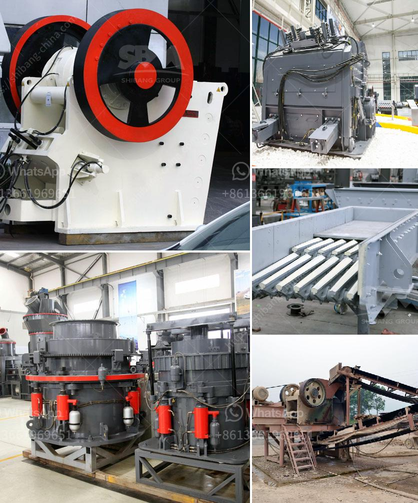

<h3>old jaw crusher for sale in kenya</h3>
The jaw crusher was invented in the early 19th century by Eli Whitney Blake. It wasn't until the late 1860s that the world first started to use the jaw crusher. Jaw crushers were first introduced to the world by Universal Engineering Corp. in 1906, and they have remained a staple of the mining industry ever since.

In Kenya, the mining industry is one of the key sectors driving the country's economic growth. Mining contributes significantly to the country's GDP and provides employment opportunities for thousands of Kenyans. As the mining industry continues to grow, the demand for mining equipment such as jaw crushers increases.

Old jaw crushers are widely used in mining and quarrying industries due to their simple design and reliable operation. The advantages of old jaw crushers are power, economy, and high productivity. And because of their low production costs and low maintenance requirements, they are an excellent choice for small and medium-sized enterprises.

One of the key advantages of old jaw crushers is their ability to crush large rocks into smaller rocks, gravel, or rock dust. This allows the materials to be processed more efficiently, saving valuable time and resources. Additionally, old jaw crushers have a wide range of applications, such as in the construction industry for the production of aggregates, in the mining industry for the extraction of minerals, and in the recycling industry for the processing of demolition waste.

The availability of old jaw crushers for sale in Kenya provides a cost-effective solution for customers looking to purchase crushing equipment. The availability of these machines enables customers to strategically plan their operations and optimize their production efficiency. Moreover, purchasing an old jaw crusher allows customers to have a reliable and proven piece of equipment that has stood the test of time.

However, before purchasing an old jaw crusher, it is essential to consider several factors. First, the condition of the machine should be thoroughly inspected to ensure that it is in good working order. It is also necessary to determine if any spare parts are readily available and if there is a local service provider who can provide maintenance and repair services.

Furthermore, the specific requirements of the mining operation should be taken into account when selecting an old jaw crusher. Factors such as the input size of the material, the desired output size, and the capacity of the machine should all be considered. It is advisable to consult with a mining equipment expert or a professional engineer to determine the most suitable jaw crusher for a particular mining operation.

In conclusion, old jaw crushers for sale in Kenya offer a cost-effective and reliable solution for customers in the mining industry. These machines have stood the test of time and have proven their worth in countless mining operations worldwide. By carefully considering the specific requirements of the mining operation, customers can find an old jaw crusher that meets their needs and contributes to their overall success.
<h3>Contact us</h3><ul><li><strong>Whatsapp:&nbsp;<a href="https://wa.me/8613661969651">+8613661969651</a></strong></li><li><a href="https://swt.shibang-china.com/?git&amp;zhl&amp;old jaw crusher for sale in kenya"><strong>Online Service(chat now)</strong></a></li></ul><h3>Related</h3><ul><li><a href='capacity 1 to 5 tons per hour price.md'>capacity 1 to 5 tons per hour price</a></li><li><a href='use of the ball mill.md'>use of the ball mill</a></li><li><a href='capacity stone crusher.md'>capacity stone crusher</a></li><li><a href='stone crusher punjab ropar.md'>stone crusher punjab ropar</a></li><li><a href='stone crusher kapasitas.md'>stone crusher kapasitas</a></li></ul>