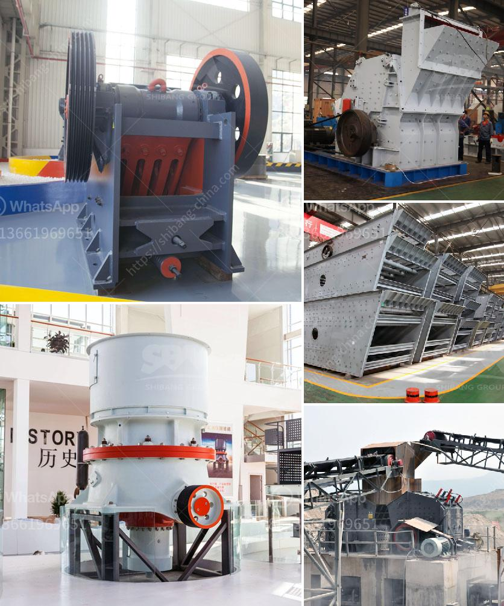

<h3>ore crusher copper ore crusher</h3>
The mining industry plays a crucial role in the global economy, supplying materials for various sectors such as construction, manufacturing, energy, and transportation. One of the most valuable minerals extracted from the earth is copper ore, which is renowned for its excellent thermal and electrical conductivity. Unlocking the potential of this precious resource requires advanced machinery like the ore crusher that efficiently breaks down copper ore, enabling its transformation into useful products.

At its core, an ore crusher is a machine designed to grind and crush mineral rocks into smaller pieces for further processing. Copper ore crushers specifically perform the important task of crushing copper ore rocks into more manageable sizes for smelting and refining. They tend to be employed in large-scale mining operations. However, they can also be utilized in smaller-scale operations where smaller-sized materials need to be processed.

The primary purpose of an ore crusher is to ensure that all valuable minerals within the ore can be extracted and used properly. This aids greatly in the mining process by reducing overall costs and maximizing productivity. At the same time, it also enhances safety, as smaller pieces of rock are easier to handle and transport, reducing the risk of accidents.

Copper ore crushers are commonly used in larger crushing operations, where the average size of the rocks being crushed is more than 60mm. For these types of crushers, they are essential for breaking down copper ore into smaller particles. These machines have a conical or domed crushing member called a mantle, which is hinged to a gyrating spindle. The mantle rotates inside a fixed bowl-shaped shell, which is lined with hardened steel, offering great protection against wear and tear.

In the process of crushing the ore, the ore crusher is used to turn big-sized stones to small particles that can be used in various industries. There are different crushers available that are used to crush various types of ore, including copper ore. The most common type of ore crusher is the jaw crusher, which is generally used for primary crushing. It can process various minerals such as copper ore, iron ore, gold ore, bauxite, limestone, etc.

Another type of ore crusher commonly used is the impact crusher. Unlike the jaw crusher, the impact crusher uses high-speed impact force to crush ores and rocks. It stands out for its excellent cubic particle shape and wide applicable materials, making it suitable for crushing various ore types, including copper ore.

In addition to jaw crushers and impact crushers, other types of ore crushers may include cone crushers, hammer crushers, and even portable and mobile installations. These crushers offer high flexibility and convenience, allowing mining companies to crush ore on-site and transport it to the processing plant. This eliminates the need for costly transportation and reduces the environmental impact associated with long-distance hauling.

In conclusion, the ore crusher is an essential piece of machinery for any mining or quarrying operation. It efficiently breaks down copper ore into smaller, manageable sizes, enabling a smooth and profitable mining process. With advances in technology, ore crushers are becoming more versatile and efficient, providing greater opportunities for the extraction of valuable minerals from copper ore and other resources.
<h3>Contact us</h3><ul><li><strong>Whatsapp:&nbsp;<a href="https://wa.me/8613661969651">+8613661969651</a></strong></li><li><a href="https://swt.shibang-china.com/?git&amp;zhl&amp;ore crusher copper ore crusher"><strong>Online Service(chat now)</strong></a></li></ul><h3>Related</h3><ul><li><a href='vibrating screen for crusher plant.md'>vibrating screen for crusher plant</a></li><li><a href='rock crushing cone.md'>rock crushing cone</a></li><li><a href='south africa mobile crusher.md'>south africa mobile crusher</a></li><li><a href='used portable impact crusher for sale in uae.md'>used portable impact crusher for sale in uae</a></li><li><a href='cost of concrete batch plant.md'>cost of concrete batch plant</a></li></ul>