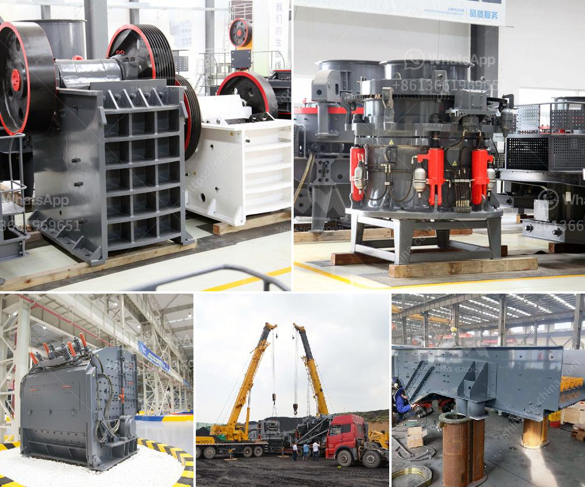

<h3>ore crusher mining equipment business plan</h3>
In order to successfully set up a stone crushing plant, you need to make a complete business plan. This can potentially save you some serious time and money! The business opportunity to fill the demand and supply gap would be quite profitable.

The crushing plant project will be made to operate to the maximum capacity possible. Good quality products of high strength will be used. Mining company wants to establish a quarrying project near the Lachlan Fold Belt in southeastern New South Wales. The proposal is to mine approximately 500t of product per day over a 10-year period.

This document contains the necessary information required for a successful quarrying. The quarrying business plan template is comprehensive enough, and it covers all the aspects of a standard business plan of any kind. With this business plan, you can easily embrace all the various dynamics affecting your mineral resources business and its environment.

The mining equipment and ore crushers play an important role in the mineral handling process. They crush the raw ore into smaller pieces to reduce the particle size, facilitating further processing. This ensures optimal efficiency and versatility in the crushing process. These machines are essential for breaking down the raw material into usable size for further processing.

When it comes to choosing the right equipment, there are several factors that need to be considered. These include the type of ore, the size of the input material, as well as the desired output size. Different machines have different capabilities, so it's important to select the equipment that best fits the specific needs of your mining operation.

Some commonly used ore crushers include jaw crushers, impact crushers, cone crushers, and hammer crushers. Jaw crushers are often used for primary crushing, while impact crushers are used for secondary or tertiary crushing. Cone crushers and hammer crushers are commonly used in the mining industry to crush various materials such as limestone, basalt, granite, iron ore, and coal.

In addition to crushers, there are various types of mining equipment that are used for transporting, drilling, and extracting minerals from the ground. These include loaders, haul trucks, drilling rigs, and excavators. Each piece of equipment serves a specific purpose in the mining process, and it's important to have a comprehensive plan that includes all the necessary equipment for your particular operation.

Having a well-thought-out business plan is crucial for the success of any mining operation. It not only helps you secure the necessary funding and resources, but it also provides a roadmap for your business and helps you make informed decisions. By considering all the factors and properly planning your crushing equipment needs, you can ensure a successful and profitable mining operation.
<h3>Contact us</h3><ul><li><strong>Whatsapp:&nbsp;<a href="https://wa.me/8613661969651">+8613661969651</a></strong></li><li><a href="https://swt.shibang-china.com/?git&amp;zhl&amp;ore crusher mining equipment business plan"><strong>Online Service(chat now)</strong></a></li></ul><h3>Related</h3><ul><li><a href='gold sand processing technology.md'>gold sand processing technology</a></li><li><a href='lsx sand washing machine.md'>lsx sand washing machine</a></li><li><a href='crusher stone plant limpopo.md'>crusher stone plant limpopo</a></li><li><a href='ball mill for manufacturing.md'>ball mill for manufacturing</a></li><li><a href='feldspar stone crushing plant.md'>feldspar stone crushing plant</a></li></ul>