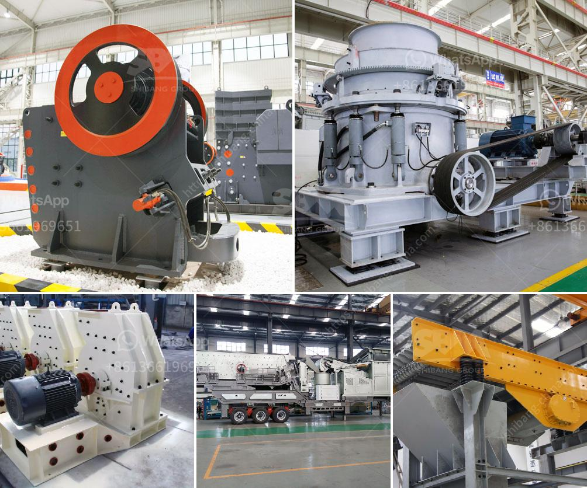

<h3>paint grinding ball mill</h3>
Paint grinding ball mill is a necessary machine in paint production. As we all know, paint can be applied to various surfaces, such as walls, furniture, cars, etc. However, the processing of paint requires a considerable amount of energy and resources. This is where the paint grinding ball mill comes into play.

The paint grinding ball mill is a key piece of equipment for grinding crushed materials, and it is widely used in production lines for powders such as cement, silicates, refractory material, fertilizer, glass ceramics, etc., as well as for ore dressing of both ferrous non-ferrous metals. The paint grinding ball mill is mainly used for grinding pigments and cement. The materials to be ground are continuously fed into the mill through the end trunnion and is ground by impact and grinding of steel balls.

The paint grinding ball mill has been used in paint industries for many years. When it comes to the grinding process, it relies on heavy steel balls to grind materials down by continuous impact and friction between the balls. The milling process not only improves the particle size distribution, but also removes impurities from the pigments, resulting in a more even and vibrant color when applied.

The design of the paint grinding ball mill is simple but effective. The mill consists of a cylindrical vessel filled with grinding media, such as steel balls or ceramic beads. The pigment particles are dispersed in the mill base by the shear forces generated by the movement of the grinding media. As the mill rotates, the grinding media continuously impacts and grinds the pigment particles until the desired particle size is achieved.

The size and type of grinding media used in the paint grinding ball mill can greatly affect the final result. For example, using larger balls will result in a coarser grind, while using smaller balls will produce a finer grind. The choice of grinding media also depends on the viscosity and density of the paint. In general, steel balls are preferred for their high impact and grinding strength, while ceramic beads are used for their chemical resistance and durability.

In addition to its critical role in the paint production process, the paint grinding ball mill also offers several advantages. Firstly, it allows for precise control of the particle size distribution, resulting in consistent and reproducible color properties. Secondly, it can effectively grind and disperse different types of pigments, including organic, inorganic, and metallic pigments. Finally, the paint grinding ball mill is energy-efficient, requiring less power and resources compared to other grinding methods.

In conclusion, the paint grinding ball mill is a necessary machine for paint production. It plays a crucial role in improving color properties, dispersing pigments, and achieving a consistent particle size distribution. With its simple design and effective grinding mechanism, the paint grinding ball mill is a reliable and efficient tool for the paint industry.
<h3>Contact us</h3><ul><li><strong>Whatsapp:&nbsp;<a href="https://wa.me/8613661969651">+8613661969651</a></strong></li><li><a href="https://swt.shibang-china.com/?git&amp;zhl&amp;paint grinding ball mill"><strong>Online Service(chat now)</strong></a></li></ul><h3>Related</h3><ul><li><a href='chrome mining process machines.md'>chrome mining process machines</a></li><li><a href='ore crusher mining equipment business plan.md'>ore crusher mining equipment business plan</a></li><li><a href='portable crusher plant crusher plant price.md'>portable crusher plant crusher plant price</a></li><li><a href='machine layout gypsum board manufacturing.md'>machine layout gypsum board manufacturing</a></li><li><a href='gravel and sand supply business plan pdf.md'>gravel and sand supply business plan pdf</a></li></ul>