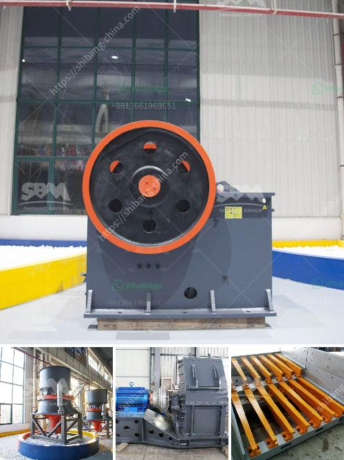

<h3>pe series jaw crusher and ton per</h3>
The PE series jaw crusher is widely used in the mining industry due to its high efficiency in crushing minerals and stones. The high crushing ratio and even particle size make it suitable for crushing materials of different hardness. However, the price of the PE series jaw crusher is relatively high compared with other crushers. Therefore, it is essential to comprehensively analyze its advantages and disadvantages before making a purchasing decision.

Firstly, the PE series jaw crusher is known for its extraordinary durability. Its sturdy frame construction and high-quality components ensure its long lifespan, reducing the need for frequent replacements. This results in significant cost savings for the user in the long run. Additionally, the jaw crusher is equipped with a powerful motor, ensuring efficient operation even under heavy workloads.

Moreover, the PE series jaw crusher is designed with the user's comfort in mind. The adjustable eccentric shaft allows for easy adjustment of the discharge port, providing greater flexibility in terms of the final product size. The jaw crusher also features a hydraulic toggle plate, which enhances its functionality by reducing downtime caused by maintenance and repairs.

Furthermore, the PE series jaw crusher is praised for its high crushing capacity. It is capable of processing large volumes of materials, making it suitable for industrial applications where large quantities of minerals or stones need to be crushed. This makes the PE series jaw crusher an excellent choice for mining companies and construction sites that deal with extensive material crushing.

Nevertheless, the PE series jaw crusher does have certain limitations. One of the main drawbacks is its high price point. The initial investment required to purchase a PE series jaw crusher might deter small or medium-sized businesses from opting for this equipment. However, it is important to consider the long-term benefits and cost savings that can be achieved by using a durable and efficient crusher.

Additionally, the PE series jaw crusher may not be the most suitable option for processing materials with high hardness. Its maximum feed size and crushing capacity may not be sufficient to handle extremely hard rocks or minerals. In such cases, alternative crushers with higher crushing capacities, such as cone crushers or impact crushers, may be more appropriate.

In conclusion, the PE series jaw crusher is a reliable and efficient piece of equipment that offers many benefits for its users. Its durability, high crushing capacity, and adjustable features make it suitable for various applications in the mining industry. However, the high price and limited suitability for processing extremely hard materials should be taken into account when considering its purchase. Ultimately, it is essential to assess the specific needs and requirements of the project before deciding on the most suitable crusher.
<h3>Contact us</h3><ul><li><strong>Whatsapp:&nbsp;<a href="https://wa.me/8613661969651">+8613661969651</a></strong></li><li><a href="https://swt.shibang-china.com/?git&amp;zhl&amp;pe series jaw crusher and ton per"><strong>Online Service(chat now)</strong></a></li></ul><h3>Related</h3><ul><li><a href='sand making stone quarry.md'>sand making stone quarry</a></li><li><a href='vibrating feeder screen.md'>vibrating feeder screen</a></li><li><a href='looking for hammer mill.md'>looking for hammer mill</a></li><li><a href='floatation equipment iron ore beneficiation germany.md'>floatation equipment iron ore beneficiation germany</a></li><li><a href='sample business plan for a stone mining.md'>sample business plan for a stone mining</a></li></ul>