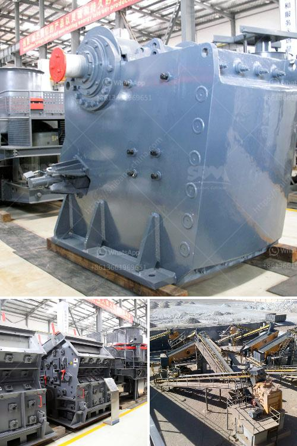

<h3>pebble and basalt production line in panama</h3>
In recent years, the production of pebbles and basalt has witnessed a significant surge in Panama, making it a burgeoning industry in the region. This growth can be attributed to the increasing demand for construction materials that are not only durable but also environmentally friendly. With its abundance of natural resources, Panama is fast becoming a major player in the production of pebbles and basalt.

One of the primary uses of pebbles and basalt is in the construction sector. These materials are highly sought after for their strength, durability, and aesthetic appeal. Pebbles are commonly used in landscaping projects, decorative purposes, and as a base material for driveways and walkways. Basalt, on the other hand, is utilized for road construction, railroad ballast, and concrete aggregate, thanks to its excellent load-bearing properties.

The production line for pebbles and basalt in Panama employs state-of-the-art machinery and technology to extract and process the raw materials. The process begins with the extraction of pebbles and basalt from quarries, where explosives are used to loosen the stone. Once the stones are extracted, they are sorted, crushed, and screened to meet the desired specifications. The final product is then loaded onto trucks or containers for transportation to construction sites.

Environmental sustainability is a key focus in the pebble and basalt production industry in Panama. Quarrying activities are conducted in an environmentally responsible manner to minimize the impact on local ecosystems. Measures such as proper waste management, soil erosion prevention, and reforestation are taken to ensure the long-term viability of the industry.

As the demand for construction materials continues to rise, the pebble and basalt production line in Panama is poised for further growth. The industry's commitment to sustainability and the utilization of advanced technologies positions it as a desirable supplier globally. Panama's strategic location, coupled with its abundant natural resources, makes it an ideal destination for investors looking to capitalize on the growing demand for pebbles and basalt in the international market.

In conclusion, the pebble and basalt production line in Panama is rapidly evolving into a thriving industry. With its superior quality and environmentally conscious practices, Panama is well-positioned to become a major player in the global construction materials market. The country's commitment to sustainable development ensures a positive outlook for the future of this burgeoning industry.
<h3>Contact us</h3><ul><li><strong>Whatsapp:&nbsp;<a href="https://wa.me/8613661969651">+8613661969651</a></strong></li><li><a href="https://swt.shibang-china.com/?git&amp;zhl&amp;pebble and basalt production line in panama"><strong>Online Service(chat now)</strong></a></li></ul><h3>Related</h3><ul><li><a href='crusher type 600 tph.md'>crusher type 600 tph</a></li><li><a href='impact crushers for sale in usa.md'>impact crushers for sale in usa</a></li><li><a href='list of used machines coal mining.md'>list of used machines coal mining</a></li><li><a href='china crusher manufacturer.md'>china crusher manufacturer</a></li><li><a href='small crusher machine.md'>small crusher machine</a></li></ul>