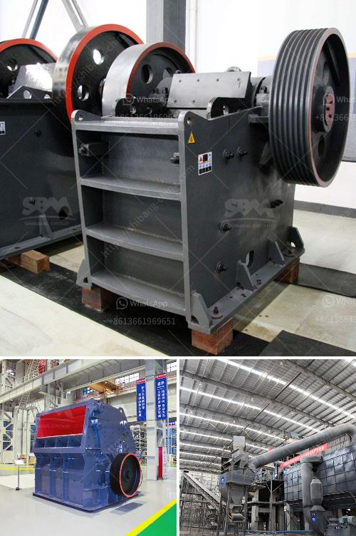

<h3>pebble crushing plant</h3>
Construction projects demand a substantial amount of quality aggregate materials to ensure durability and strength. Among these aggregates, pebble stones have become an incredibly favored choice due to their natural beauty and exceptional durability. To meet this ever-growing demand for high-quality pebble aggregates, pebble crushing plants have emerged as a solution that not only optimizes the extraction process but also enhances the quality of construction materials.

A pebble crushing plant is specially designed and dedicated to crush and process pebble stones, sourced from rivers, mountains, or oceans. These pebble stones are typically smooth and rounded, making them excellent materials for construction purposes. The crushing plant consists of different machines that work together to break down pebble stones into smaller sizes suitable for various construction applications.

One of the primary machines in a pebble crushing plant is the jaw crusher. This robust machine plays a crucial role in the initial stage of the crushing process. The jaw crusher breaks down large-sized pebble stones into smaller pieces, enabling further processing. It operates with high efficiency and can handle a variety of pebble sizes, ensuring that all materials are uniformly crushed.

After the jaw crusher, the next vital component is the cone crusher. This machine finely crushes the smaller pebble stones, transforming them into fine aggregates. Cone crushers are especially proficient in producing cubical-shaped materials, which are highly desirable for construction purposes. This shape not only enhances the visual appeal of structures but also improves the materials' load-bearing capacity.

To further refine the crushed pebble aggregates, the vibrating screen is employed. This essential equipment helps separate the pebble stones based on their different sizes. By separating the materials, the vibrating screen ensures that each particle is efficiently utilized and directed towards the appropriate production line. This process enhances the overall quality of the final aggregates, ensuring they meet the desired specifications.

Apart from these core machines, pebble crushing plants may also incorporate various auxiliary equipment to optimize the production process. For example, conveyors are used to transport the crushed materials between different stages of the crushing plant, minimizing manual handling and improving efficiency. Dust collectors are also essential to maintain a clean working environment, ensuring the safety of the operators.

In conclusion, pebble crushing plants are indispensable in the production of high-quality construction materials. These plants efficiently break down and refine pebble stones, transforming them into the desired aggregate sizes. With the help of jaw crushers, cone crushers, and vibrating screens, these plants ensure uniform crushing, excellent shape, and consistent quality. As a result, the produced aggregates not only meet the strict construction standards but also contribute to the aesthetic appeal of structures.

The ever-increasing demand for quality pebble aggregates necessitates the establishment of more pebble crushing plants. By investing in these plants, construction companies can secure a reliable supply of superior quality aggregate materials. Moreover, the utilization of these plants also promotes sustainable practices by maximizing the use of natural resources and reducing the environmental impact associated with quarrying fresh materials. Ultimately, pebble crushing plants play a vital role in the construction industry by enabling the production of durable and visually pleasing structures.
<h3>Contact us</h3><ul><li><strong>Whatsapp:&nbsp;<a href="https://wa.me/8613661969651">+8613661969651</a></strong></li><li><a href="https://swt.shibang-china.com/?git&amp;zhl&amp;pebble crushing plant"><strong>Online Service(chat now)</strong></a></li></ul><h3>Related</h3><ul><li><a href='manganese ore sintering process.md'>manganese ore sintering process</a></li><li><a href='calcium carbonate plant industry.md'>calcium carbonate plant industry</a></li><li><a href='quarry equipment in kenya.md'>quarry equipment in kenya</a></li><li><a href='stone crusher machine in nigeria.md'>stone crusher machine in nigeria</a></li><li><a href='cheap mobile crusher.md'>cheap mobile crusher</a></li></ul>