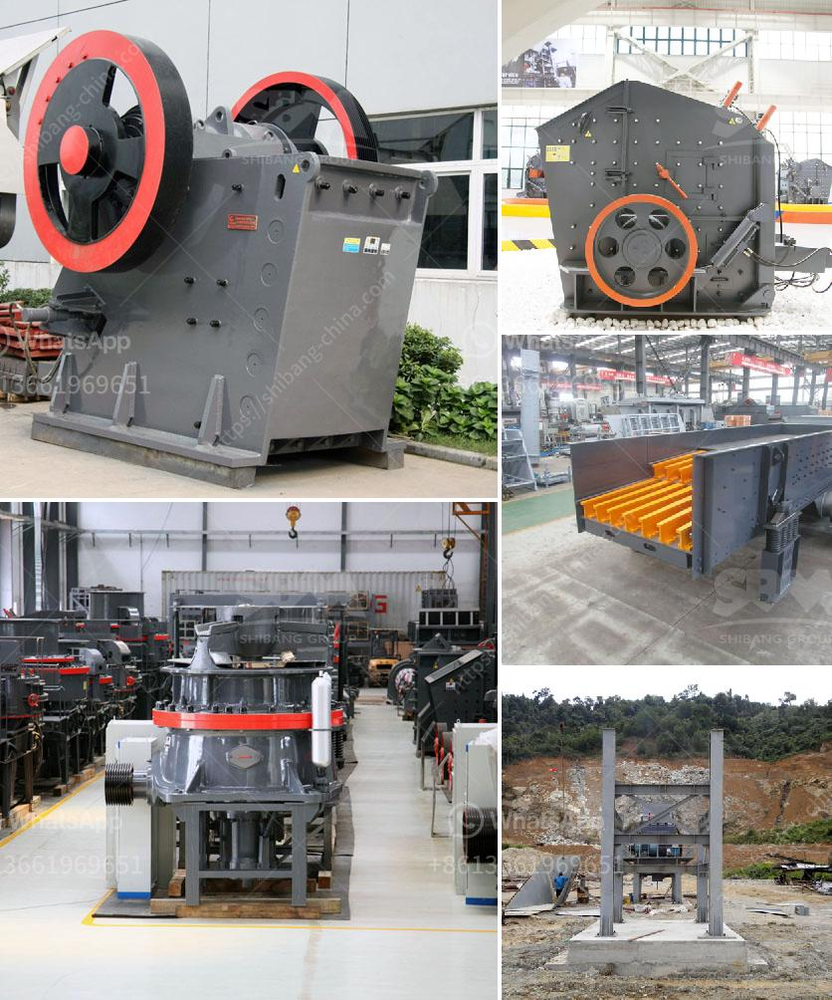

<h3>petroleum coke grinding</h3>
Petroleum coke, or petcoke, is a byproduct of the oil refining process. As the demand for petroleum products continues to grow, so does the amount of petcoke generated. Similarly, the need for efficient grinding processes to liberate the valuable carbon-rich material from the impurities becomes crucial.

Petcoke is a solid carbonaceous material, typically in the form of spherical particles, with high carbon content and low moisture. It is primarily used as a source of energy in cement kilns, power plants, and other industrial applications. However, before it can be effectively utilized, it must undergo a grinding process to achieve the desired particle size distribution.

There are several reasons why grinding petcoke is important. Firstly, the finer the petcoke particles, the better its combustion characteristics. Grinding helps to increase the surface area of the particles, allowing for more efficient combustion and thus higher energy production. Additionally, a finer particle size distribution ensures better handling and transportation of petcoke, preventing issues such as dustiness or blockages in conveying systems.

To achieve the desired particle size distribution, various grinding techniques and equipment are employed. One common method is the use of a vertical roller mill (VRM), which breaks down the petcoke by applying grinding pressure and a combination of shear and compression forces. This mechanical action effectively reduces the particle size, resulting in a fine powder.

The choice of grinding equipment depends on several factors, including the size and hardness of the petcoke particles, the desired fineness, and the capacity requirements. For instance, a ball mill is commonly used for petcoke grinding as it can grind particles of various sizes. Another option is a Raymond roller mill, which achieves the desired fineness by applying a combination of compression, shear, and impact forces.

In addition to selecting the appropriate grinding equipment, it is also important to consider the grinding aids that can enhance the efficiency of the process. Grinding aids are chemicals added to the grinding mill to improve its performance. They can improve the grinding efficiency, reduce energy consumption, and increase the strength and flowability of the ground petcoke. Some commonly used grinding aids for petcoke include triethanolamine (TEA), diethylene glycol (DEG), and tri-isopropanolamine (TIPA).

It is essential to note that the grinding process should be conducted in a controlled environment to prevent the release of dust, which can pose health and environmental hazards. Dust collection systems, such as bag filters or electrostatic precipitators, are crucial to capture and remove the fine particles generated during grinding.

In conclusion, the grinding of petroleum coke is an important process in the utilization of this carbon-rich material. Effective grinding techniques and equipment, combined with the use of grinding aids, can improve combustion efficiency, handling, and transportation of petcoke. Moreover, the grinding process should be carried out in a controlled environment to prevent dust emissions. As petcoke continues to be a significant energy source, ongoing efforts to optimize the grinding process are crucial for efficient and sustainable utilization.
<h3>Contact us</h3><ul><li><strong>Whatsapp:&nbsp;<a href="https://wa.me/8613661969651">+8613661969651</a></strong></li><li><a href="https://swt.shibang-china.com/?git&amp;zhl&amp;petroleum coke grinding"><strong>Online Service(chat now)</strong></a></li></ul><h3>Related</h3><ul><li><a href='used crusher plants canada.md'>used crusher plants canada</a></li><li><a href='aggregate crushing cost analysis in india.md'>aggregate crushing cost analysis in india</a></li><li><a href='grinding of ceramic minerals.md'>grinding of ceramic minerals</a></li><li><a href='rotary grinder machine thailand.md'>rotary grinder machine thailand</a></li><li><a href='petroleum coke process.md'>petroleum coke process</a></li></ul>