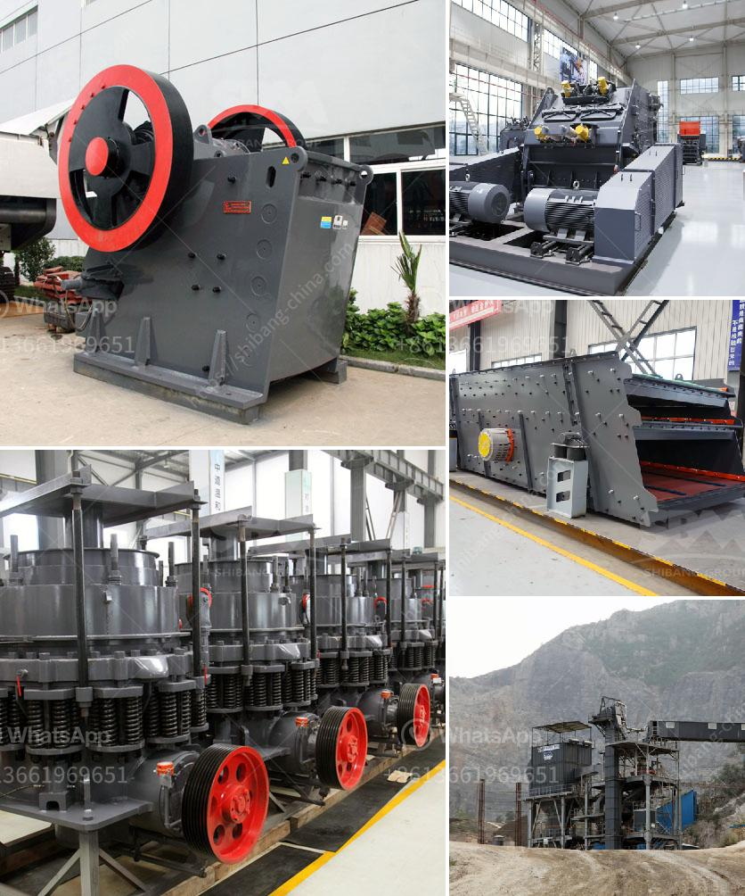

<h3>petroleum coke process</h3>
Petroleum coke, or petcoke, is a significant byproduct of the oil refining process. It is composed of carbon-rich materials derived from the heavy, low-quality residues that remain after the distillation of crude oil. The production of petcoke plays a crucial role in the oil refining industry, as it not only provides an additional revenue stream but also helps to maximize the yield of valuable products.

The process of producing petroleum coke begins with the refining of crude oil. After the initial distillation, the heavier fractions of oil, known as residual oil, are further treated to remove impurities and increase their value. The residue obtained from this secondary treatment is referred to as "green coke". Green coke contains approximately 90-95% carbon and a small percentage of hydrogen, sulfur, nitrogen, and other elements.

To convert green coke into a usable product, it must undergo further processing. This involves a series of thermal treatments, collectively referred to as "calcination", designed to remove the remaining volatile components and enhance the carbon content. The calcination process typically takes place in a rotary kiln at high temperatures ranging from 1200 to 1350 degrees Celsius.

During calcination, the green coke is fed into the kiln and exposed to the high heat. The volatile matter present in the coke starts to vaporize, leaving behind a substance known as "calcined coke". Calcined coke contains a higher carbon content of approximately 97-99% and is characterized by its hard and porous structure. It is this unique composition that makes calcined coke an excellent raw material for various industrial applications.

One of the primary uses of petroleum coke is as a fuel source in the cement industry. Due to its high carbon content, calcined coke acts as a substitute for coal in kilns, where it provides the necessary heat for the cement manufacturing process. Additionally, the high sulfur content in petcoke helps to lower the emissions of sulfur dioxide during combustion, making it an attractive alternative to traditional fossil fuels.

Petroleum coke is also extensively utilized in the production of anodes for aluminum smelting. The calcined coke is mixed with coal tar pitch and other additives to form a paste that is molded into blocks or electrodes. These anodes are then used in the electrolytic process to produce aluminum, providing a vital component for the metals industry.

Apart from these major applications, petcoke is also used in the production of graphite electrodes, carbon black, and various industrial chemicals. Its high carbon content and low ash content make it a preferred choice in these industries for its durability and conductivity.

In conclusion, the petroleum coke process is an essential part of the oil refining industry. It involves the thermal treatment of residue left after primary distillation to produce calcined coke, which finds numerous applications in various industries. The utilization of petcoke not only generates additional revenue for refineries but also helps to maximize the yield of valuable products and reduce environmental impacts. However, it is essential to address the concerns regarding emissions associated with its combustion while continuing to explore sustainable alternatives.
<h3>Contact us</h3><ul><li><strong>Whatsapp:&nbsp;<a href="https://wa.me/8613661969651">+8613661969651</a></strong></li><li><a href="https://swt.shibang-china.com/?git&amp;zhl&amp;petroleum coke process"><strong>Online Service(chat now)</strong></a></li></ul><h3>Related</h3><ul><li><a href='silica water washing plant price.md'>silica water washing plant price</a></li><li><a href='japan jaw crusher price.md'>japan jaw crusher price</a></li><li><a href='sayaji jaw crusher x specifiion.md'>sayaji jaw crusher x specifiion</a></li><li><a href='small scale iron ore pallet plant.md'>small scale iron ore pallet plant</a></li><li><a href='gyratory cone crusher manufacturers china.md'>gyratory cone crusher manufacturers china</a></li></ul>