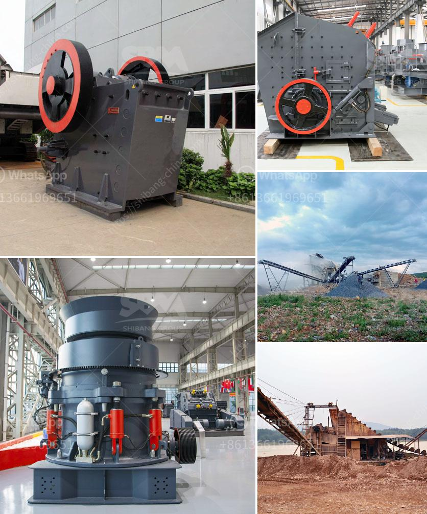

<h3>philippine limestone crusher for calcium carbonate</h3>
The Philippines is known for its rich mineral resources. Every year, the country produces large amounts of limestone, which is used for construction purposes, as well as for manufacturing cement, iron and steel, chemicals, and many other industrial products.

One of the essential uses of limestone is for the production of calcium carbonate. Calcium carbonate, or CaCO3, is a versatile industrial mineral that has many applications in various industries. It is commonly used as a filler material in the manufacturing of paints, papers, plastics, rubber, ceramics, and even pharmaceuticals.

In the Philippines, limestone is abundant, especially in the northern part of the country. However, before it can be used in various applications, it needs to be crushed and processed into fine particles.

This is where the Philippine limestone crusher comes in. With the help of advanced technology and superior quality equipment, we have been able to design and manufacture a wide range of crushers specifically for limestone crushing applications.

The crushers available in the market today are equipped with either a fixed or hydraulic support system, depending on the nature of the limestone to be crushed. The fixed support system is suitable for soft and medium-hard limestone, while the hydraulic support system is better suited for harder limestone.

Our Philippine limestone crushers are equipped with advanced PLC electrical control system, ensuring precise control and monitoring of the crushing process. The PLC control system also allows for easy adjustment of the crusher settings to optimize the production of calcium carbonate of various particle sizes.

Additionally, our crushers are designed with high-quality wear-resistant materials to withstand the abrasive nature of limestone. This ensures long-lasting performance and reduces downtime for maintenance and repairs.

Moreover, the Philippine limestone crushers are also equipped with advanced safety features to protect the operators and prevent accidents. These features include emergency stop buttons, safety guards, and automatic lubrication systems.

Furthermore, our crushers are designed to be environmentally friendly. The dust and noise generated during the crushing process are minimized, thanks to the use of advanced dust suppression systems and noise reduction features. This ensures a safe and clean working environment for the operators.

In conclusion, the Philippine limestone crusher plays an important role in the production of calcium carbonate. With the abundant limestone resources in the country, the crushers enable the efficient and sustainable utilization of these resources to create value for various industries.

As a leading manufacturer and supplier of limestone crushers in the Philippines, we are committed to delivering superior quality equipment that meets the highest standards of performance, reliability, and safety. We take pride in our ability to provide tailored solutions to meet the specific requirements of our customers and contribute to their success in their respective industries.
<h3>Contact us</h3><ul><li><strong>Whatsapp:&nbsp;<a href="https://wa.me/8613661969651">+8613661969651</a></strong></li><li><a href="https://swt.shibang-china.com/?git&amp;zhl&amp;philippine limestone crusher for calcium carbonate"><strong>Online Service(chat now)</strong></a></li></ul><h3>Related</h3><ul><li><a href='lsx sand washing machine.md'>lsx sand washing machine</a></li><li><a href='china quarrying machine prices china.md'>china quarrying machine prices china</a></li><li><a href='mobile crusher capacity per hour.md'>mobile crusher capacity per hour</a></li><li><a href='salt crusher plant process price.md'>salt crusher plant process price</a></li><li><a href='jual stone crusher portable.md'>jual stone crusher portable</a></li></ul>