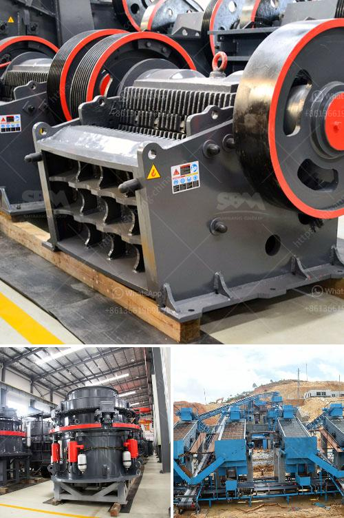

<h3>philippines stone crusher</h3>
The Philippines is a country rich in mineral resources. With its close proximity to China, the Philippines has become a hotspot for mining operations, attracting multinational companies and individual miners alike. Stone crushers are essential machines in the mining and construction industries. Their main purpose is to reduce large rocks into smaller sizes for further processing. As a leading stone crusher manufacturer and supplier in the Philippines, Qiming Machinery takes pride in offering the best equipment, parts, and service to its customers.

One of the reasons why our stone crushers are in high demand is because of their ability to produce high-quality aggregates for various construction applications. Whether it is for road construction, building foundations, or concrete production, our crushers can crush rocks of different hardness levels to meet the required specifications.

Another advantage of our stone crushers is their mobility. Our machines are designed to be easily transported from one site to another, making them ideal for mining operations that move from one location to another. This mobility also allows our customers to process materials directly at the source, reducing transportation costs and maximizing efficiency.

At Qiming Machinery, we understand that downtime is costly for our customers. That is why we not only provide reliable stone crushers but also offer comprehensive after-sales service. Our team of experienced technicians is available 24/7 to provide troubleshooting assistance, perform routine maintenance, and repair any issues that may arise with our machines.

In conclusion, stone crushers play a crucial role in the mining and construction industries in the Philippines. With their ability to crush rocks into smaller sizes, produce high-quality aggregates, and their mobility, stone crushers are essential equipment for any mining operation. And with Qiming Machinery's commitment to quality and excellent after-sales service, customers can rely on our stone crushers to meet their crushing needs efficiently and effectively.
<h3>Contact us</h3><ul><li><strong>Whatsapp:&nbsp;<a href="https://wa.me/8613661969651">+8613661969651</a></strong></li><li><a href="https://swt.shibang-china.com/?git&amp;zhl&amp;philippines stone crusher"><strong>Online Service(chat now)</strong></a></li></ul><h3>Related</h3><ul><li><a href='limestone powder machine in india.md'>limestone powder machine in india</a></li><li><a href='supplier of vibrating screen in philippines.md'>supplier of vibrating screen in philippines</a></li><li><a href='buyers ball mill process.md'>buyers ball mill process</a></li><li><a href='used korean made stone crusher.md'>used korean made stone crusher</a></li><li><a href='mini cement plant capacity of 5 ton per day.md'>mini cement plant capacity of 5 ton per day</a></li></ul>