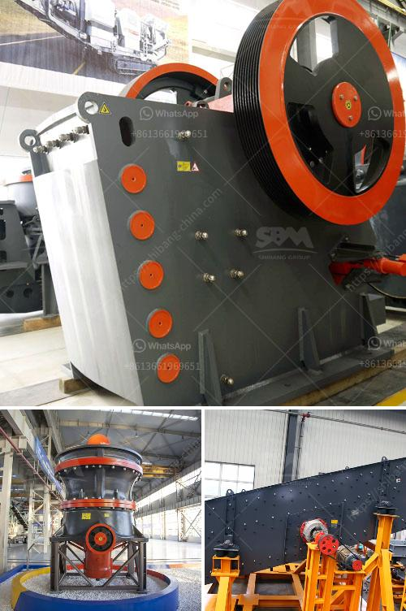

<h3>picture of a rock crusher machine</h3>
A picture of a rock crusher machine is like a glimpse into the past. From large, industrial crushers to humble rocks being crushed in makeshift contraptions, rock crushing is a fascinating and crucial industry that dates back centuries.

Despite the long history, the machines have gone through dramatic improvements over time. Today, you can find a variety of rock crushers on the market, from small and portable units to massive machines capable of crushing hundreds of tons of rocks per hour.

One common type of rock crusher is the jaw crusher. It consists of a fixed jaw plate and a movable jaw plate. When rocks pass through the crusher, the two plates come together to crush them. This process is repeated until the desired size of the crushed material is achieved.

Another commonly used rock crusher is the cone crusher. Like the jaw crusher, it uses compression to crush rocks. The difference lies in the shape of the crushing chamber and the size of the feed opening. Cone crushers are often used for secondary or tertiary crushing, as they can produce finer and more uniform-sized aggregates.

Gyratory crushers are another type of rock crusher commonly found in quarries and mines. These machines feature a conical shape and a concave surface. When rocks enter the crusher, they are crushed between the rotating mantle and the concave walls. Gyratory crushers are known for their high capacity and efficiency in crushing hard and abrasive rocks.

In recent years, technological advancements have led to the development of more specialized rock crushers. For example, impact crushers are designed to break rocks by applying forceful impacts. This is achieved by accelerating the rocks and directing them towards a stationary impact surface.

Crushing rocks may seem like a simple task, but it requires a combination of power, precision, and durability. The machines used for this purpose must be robust enough to handle the demanding nature of the job. They must also be versatile enough to accommodate different types of rocks and produce various sizes of crushed materials.

The efficiency of a rock crusher machine is often measured by the ratio of the size of the input material to the size of the output product. In engineering terms, this is known as the reduction ratio. The reduction ratio tells you the average number of times the input material is reduced in size during the crushing process.

For example, a rock crusher with a 20:1 reduction ratio means that the input material will be reduced in size by a factor of 20, producing smaller, more manageable pieces to be used for construction or other purposes. Achieving high reduction ratios is essential for ensuring the optimal performance and efficiency of rock crushers.

In conclusion, a picture of a rock crusher machine provides a glimpse into the fascinating world of rock crushing. From the humble beginnings of crude devices to the technologically advanced machines of today, rock crushers have played a vital role in the development of modern infrastructure and mining techniques. Whether it is a jaw crusher, cone crusher, or impact crusher, each type presents its own unique challenges and advantages. However, they all serve the fundamental purpose of breaking down rocks into smaller, more manageable sizes, making them an essential tool in various industries.
<h3>Contact us</h3><ul><li><strong>Whatsapp:&nbsp;<a href="https://wa.me/8613661969651">+8613661969651</a></strong></li><li><a href="https://swt.shibang-china.com/?git&amp;zhl&amp;picture of a rock crusher machine"><strong>Online Service(chat now)</strong></a></li></ul><h3>Related</h3><ul><li><a href='screen vibrating screen for sand.md'>screen vibrating screen for sand</a></li><li><a href='stone crusher manufacturers.md'>stone crusher manufacturers</a></li><li><a href='gypsum mill production.md'>gypsum mill production</a></li><li><a href='vertical ultra fine pulverizer.md'>vertical ultra fine pulverizer</a></li><li><a href='ball mills at best price in india.md'>ball mills at best price in india</a></li></ul>