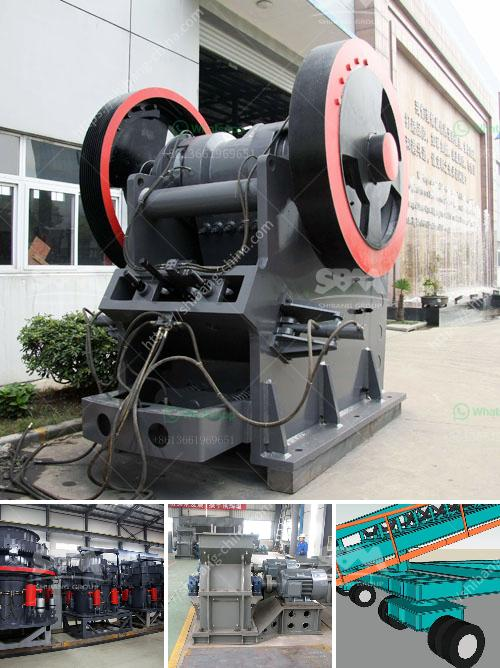

<h3>pioneer ft impact crusher</h3>
At the heart of any crushing job is an impact crusher. It is a machine that uses striking as opposed to pressure to reduce the size of material. Excavated rock can be crushed into smaller sizes to make it easier to transport or further process. And the Pioneer FT4250CC is ideal for crushing both natural and recycled materials, including concrete, asphalt, and brick.

The Pioneer FT4250CC features a heavy-duty impact crusher with a robust rotor design, which accomplishes a high reduction ratio along with impressive throughput capabilities. The crusher's chamber is equipped with four reversible blow bars, which deliver a consistent crushing action. This design produces a uniform cubical product that is ideal for all types of aggregate applications, from roadbase to manufactured sand.

What sets the Pioneer FT4250CC apart from other impact crushers on the market is its high mobility and versatility. This crushing plant is compact, allowing it to be transported easily and efficiently. The onboard power unit and control panel make it a self-contained unit, eliminating the need for additional external power sources or control centers.

Fitted with a CAT engine, the Pioneer FT4250CC has an impressive horsepower capacity, ensuring that it can handle even the toughest materials. The engine's fuel-efficient design makes this crusher cost-effective to operate, contributing to its sustainability credentials. The efficiency is further enhanced by the Crusher Variable Frequency Drive (VFD), which allows the crusher to maintain optimal performance even with varying feed rates.

Another notable feature of the Pioneer FT4250CC is its user-friendly design. The crusher's control panel is intuitive and easy to navigate, providing operators with real-time information about the crusher's performance. This information includes material flow, production rates, and engine performance. User-friendly controls make it simple to adjust settings, enabling operators to achieve the desired product size with ease.

Additionally, the Pioneer FT4250CC is equipped with advanced safety features to protect both operators and the machine itself. A wireless remote control allows operators to operate the crusher from a safe distance, reducing the risk of accidents. The machine's design also includes easy access to crucial maintenance points, ensuring that routine inspections and repairs can be carried out quickly and efficiently.

In conclusion, the Pioneer FT4250CC is a reliable and efficient mobile impact crusher that offers high performance and versatility. Its compact design, powerful engine, and user-friendly controls make it an excellent choice for a wide range of crushing applications. Whether used in construction, demolition, or quarrying, this machine will deliver consistent and high-quality results. With the Pioneer FT4250CC, crushing jobs can be completed efficiently and effectively, contributing to increased productivity and profitability.
<h3>Contact us</h3><ul><li><strong>Whatsapp:&nbsp;<a href="https://wa.me/8613661969651">+8613661969651</a></strong></li><li><a href="https://swt.shibang-china.com/?git&amp;zhl&amp;pioneer ft impact crusher"><strong>Online Service(chat now)</strong></a></li></ul><h3>Related</h3><ul><li><a href='diamond stone crusher price list.md'>diamond stone crusher price list</a></li><li><a href='the gold mining process in zimbabwe.md'>the gold mining process in zimbabwe</a></li><li><a href='stone grinder machines for sale usa.md'>stone grinder machines for sale usa</a></li><li><a href='crushing complete crushing plant 150tph 200tph.md'>crushing complete crushing plant 150tph 200tph</a></li><li><a href='crushing equipment granite quarry nigeria.md'>crushing equipment granite quarry nigeria</a></li></ul>