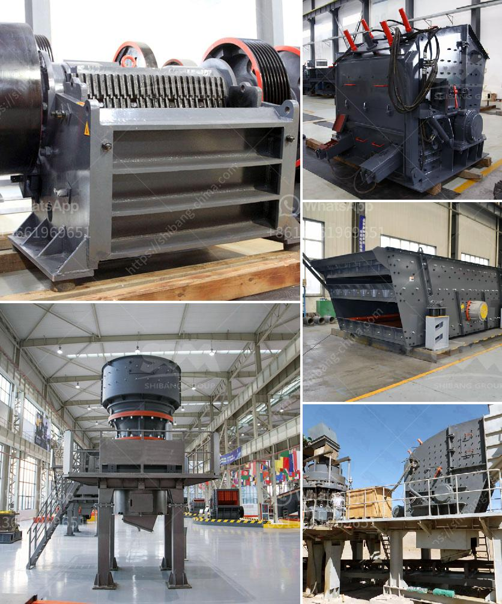

<h3>plant for manufacturing of wet ground calcium carbonate</h3>
Wet ground calcium carbonate (WGCC) is a versatile and highly sought-after mineral used in a variety of industries, including paper, plastics, rubber, and pharmaceuticals. With its unique properties and applications, the demand for WGCC continues to grow globally. To meet this demand, a reliable and efficient manufacturing plant is crucial.

The plant for manufacturing WGCC plays a pivotal role in the production process, ensuring high-quality finished products and meeting customer expectations. It involves a series of carefully designed and controlled steps to convert raw materials into wet ground calcium carbonate.

The process begins with the extraction of raw limestone or marble from the earth's crust. These minerals are then crushed and ground into a fine powder. The grinding process is vital as it affects the ultimate quality of the WGCC. To achieve the desired particle size distribution, specialized equipment such as ball mills or impact mills are used.

Once the grinding process is complete, the powder is mixed with water to create a slurry. This slurry is then subjected to further grinding, forming a fine suspension. The suspension is then transported to a settling tank, where gravity separates the solid calcium carbonate particles from the water.

After settling, the slurry undergoes a dewatering process to remove excess water, resulting in a wet cake. This cake is then dried using specialized equipment, such as rotary kilns or flash dryers, until a desired moisture content is achieved.

The dried WGCC is then sent for quality control analysis to ensure it meets the required specifications. This analysis may include testing for particle size, brightness, and chemical composition. If any deviations are found, adjustments can be made to the manufacturing process.

Once the quality control is completed, the WGCC is packaged and ready for distribution to customers. It is important to note that a comprehensive quality management system should be in place at the manufacturing plant to guarantee consistency and reliability in each batch produced.

A well-designed plant for manufacturing WGCC ensures a robust and efficient production process, enabling manufacturers to meet the continuous demands of their customers. By adhering to the highest quality standards and utilizing state-of-the-art equipment, WGCC manufacturers can ensure their products are of the utmost quality and meet the unique specifications of various industries.

In conclusion, the manufacturing of WGCC is a complex process that requires a dedicated and well-designed plant. The ability to transform raw materials into high-quality wet-ground calcium carbonate is essential in meeting the increasing global demand. With efficient manufacturing processes and stringent quality control measures, manufacturers can deliver exceptional products to cater to the diverse needs of industries worldwide.
<h3>Contact us</h3><ul><li><strong>Whatsapp:&nbsp;<a href="https://wa.me/8613661969651">+8613661969651</a></strong></li><li><a href="https://swt.shibang-china.com/?git&amp;zhl&amp;plant for manufacturing of wet ground calcium carbonate"><strong>Online Service(chat now)</strong></a></li></ul><h3>Related</h3><ul><li><a href='dolomite sand composition.md'>dolomite sand composition</a></li><li><a href='ball mill making from turkey.md'>ball mill making from turkey</a></li><li><a href='cobble stone machine nigeria.md'>cobble stone machine nigeria</a></li><li><a href='small rock crushers for recreation.md'>small rock crushers for recreation</a></li><li><a href='limestone vertical mill.md'>limestone vertical mill</a></li></ul>