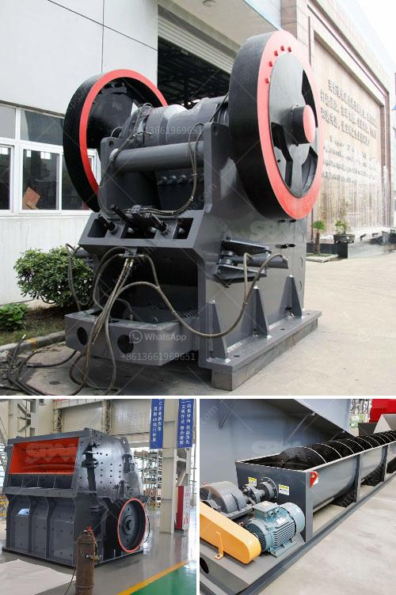

<h3>plant machinery manufacturers in germany</h3>
Germany is renowned as a global leader in the manufacturing industry, known for its precision, engineering expertise, and high-quality products. This reputation extends to the plant machinery sector, where German manufacturers have excelled in producing state-of-the-art equipment for various industries.

Plant machinery manufacturers in Germany offer a wide range of cutting-edge products designed to enhance efficiency and productivity in industrial operations. These manufacturers produce machinery and equipment for different sectors, including construction, agriculture, mining, and manufacturing.

One of the key strengths of German plant machinery manufacturers is their emphasis on quality and precision engineering. German companies are known for their stringent quality control measures, adherence to industry standards, and commitment to continuous improvement. This ensures that the machinery produced meets the highest standards of performance and durability.

Additionally, German plant machinery manufacturers are at the forefront of technological advancements. They invest heavily in research and development to stay ahead of the competition and offer innovative solutions to their customers. This focus on innovation has led to the development of advanced machinery with features such as automation, IoT integration, and energy efficiency.

Another strength of German manufacturers is their commitment to sustainability. With growing concerns about environmental impact, German machinery manufacturers prioritize energy-efficient solutions and strive to reduce the carbon footprint in their operations. This reflects a broader trend in the German manufacturing industry as a whole, where eco-friendly practices are given high importance.

Germany's plant machinery manufacturers also have a strong support system in place. The country's robust infrastructure, skilled workforce, and well-established supply chain networks contribute to the efficiency and reliability of manufacturing operations. Additionally, German manufacturers have extensive international networks, making their products accessible globally.

In conclusion, plant machinery manufacturers in Germany are recognized globally for their quality, precision engineering, technological advancements, sustainability, and strong support systems. Their products cater to a wide range of industries and continue to play a vital role in enhancing efficiency and productivity across various sectors.
<h3>Contact us</h3><ul><li><strong>Whatsapp:&nbsp;<a href="https://wa.me/8613661969651">+8613661969651</a></strong></li><li><a href="https://swt.shibang-china.com/?git&amp;zhl&amp;plant machinery manufacturers in germany"><strong>Online Service(chat now)</strong></a></li></ul><h3>Related</h3><ul><li><a href='aggregate crusher plant.md'>aggregate crusher plant</a></li><li><a href='buyers ball mill process.md'>buyers ball mill process</a></li><li><a href='vibrating screen for silica sand.md'>vibrating screen for silica sand</a></li><li><a href='write an article about jaw crusher philippines prices with 100300 words.md'>write an article about jaw crusher philippines prices with 100-300 words</a></li><li><a href='domestic stone crushers.md'>domestic stone crushers</a></li></ul>