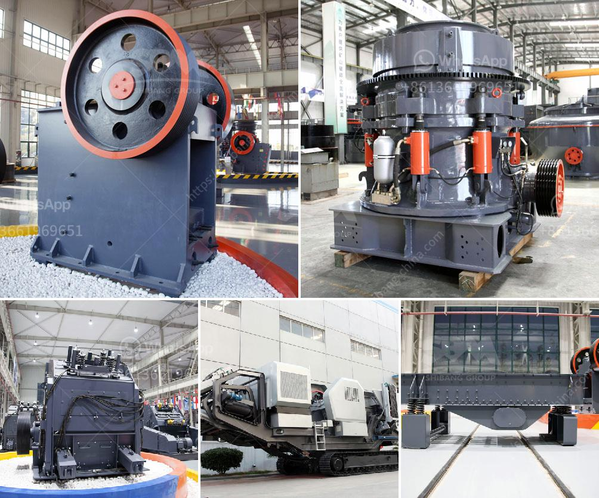

<h3>portable crusher plant crusher plant price</h3>
The mining industry is experiencing a significant shift towards the use of portable crusher plants. As the demand for materials continues to increase and sites become more remote, the need for portable crushing plants is on the rise. These plants offer a flexible and efficient solution for crushing materials at any location.

One of the key advantages of portable crusher plants is their ability to be moved from one site to another quickly and easily. This eliminates the need for costly transportation, reduces downtime, and allows for more flexibility in tackling different projects. Whether it's a small residential construction site or a large industrial project, a portable crusher plant can be easily transported and set up within a short period.

Another advantage of portable crusher plants is their cost-effectiveness. Unlike stationary crushing plants, portable crushers have a lower initial investment and operating costs. This makes them a viable option for small to medium-sized businesses that are on a tight budget. The reduced costs allow for more competitive pricing, which attracts more customers and boosts profitability.

The price of a portable crusher plant varies depending on several factors, such as production capacity, type of materials being crushed, and the specific needs of the customer. However, in general, portable crusher plants are more affordable compared to traditional stationary crushing plants. With prices starting as low as $100,000, businesses of all sizes can benefit from the advantages offered by these mobile solutions.

In terms of performance, portable crusher plants are designed to deliver high crushing capacities and efficiency. They are equipped with advanced technology, such as hydraulic systems, which ensure smooth operation and maximum productivity. Additionally, these plants are designed to accommodate different types of materials, including hard rock, ores, and construction waste, making them versatile and suitable for a wide range of applications.

In conclusion, the portable crusher plant market is growing rapidly due to its numerous advantages. From its flexibility and cost-effectiveness to its high performance and versatility, portable crusher plants are becoming the preferred choice for many businesses in the mining industry. With prices starting as low as $100,000, investing in a portable crusher plant can significantly improve profitability and help businesses stay competitive in a rapidly evolving market.
<h3>Contact us</h3><ul><li><strong>Whatsapp:&nbsp;<a href="https://wa.me/8613661969651">+8613661969651</a></strong></li><li><a href="https://swt.shibang-china.com/?git&amp;zhl&amp;portable crusher plant crusher plant price"><strong>Online Service(chat now)</strong></a></li></ul><h3>Related</h3><ul><li><a href='granite stone quarrying equipment.md'>granite stone quarrying equipment</a></li><li><a href='stone quarry machines for sale.md'>stone quarry machines for sale</a></li><li><a href='graphite ore beneficiation.md'>graphite ore beneficiation</a></li><li><a href='how to make stone crusher plant.md'>how to make stone crusher plant</a></li><li><a href='double deck bunch crusher.md'>double deck bunch crusher</a></li></ul>