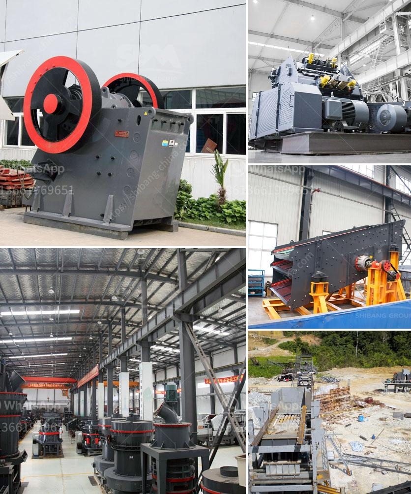

<h3>portable crushing plants for sale</h3>
Portable crushing plants are becoming increasingly popular in the mining and construction industries. These highly efficient plants are designed to be easily transported and installed, making them an attractive option for companies looking to save on transportation and installation costs.

One of the key benefits of portable crushing plants is their versatility. With the ability to crush a wide variety of materials, from hard rock to recycled materials, these plants can be used in various applications. Whether it is for road construction, building demolition, or aggregate production, portable crushing plants offer a cost-effective solution.

Another advantage of portable crushing plants is their ease of operation. Designed with user-friendly features, these plants can be set up and operated by a single person. They often come with remote control capabilities, allowing operators to adjust settings and monitor performance from a safe distance.

In terms of maintenance, portable crushing plants are also convenient. With easy access to key components and a simple design, these plants can be serviced and repaired quickly and efficiently. This reduces downtime and ensures that the plant is up and running as soon as possible.

Furthermore, portable crushing plants are environmentally friendly. Many models are equipped with dust suppression systems that minimize dust emissions during operation. This is particularly important in densely populated areas or when crushing in sensitive locations.

When it comes to purchasing a portable crushing plant, there are numerous options available. Various models offer different capacities, so it is important to consider the specific requirements of the project. Additionally, it is important to choose a reputable manufacturer that offers reliable equipment and good after-sales support.

In conclusion, portable crushing plants offer a range of benefits that make them an attractive option for companies in the mining and construction industries. Their versatility, ease of operation, low maintenance requirements, and environmental friendliness make them a cost-effective and efficient choice. Business owners looking to enhance their productivity and reduce costs should consider investing in a portable crushing plant.
<h3>Contact us</h3><ul><li><strong>Whatsapp:&nbsp;<a href="https://wa.me/8613661969651">+8613661969651</a></strong></li><li><a href="https://swt.shibang-china.com/?git&amp;zhl&amp;portable crushing plants for sale"><strong>Online Service(chat now)</strong></a></li></ul><h3>Related</h3><ul><li><a href='project report for starting a crusher plant in tamilnadu.md'>project report for starting a crusher plant in tamilnadu</a></li><li><a href='turkey cone crusher.md'>turkey cone crusher</a></li><li><a href='stone crusher germany.md'>stone crusher germany</a></li><li><a href='design of harmer mill.md'>design of harmer mill</a></li><li><a href='basalt production process.md'>basalt production process</a></li></ul>