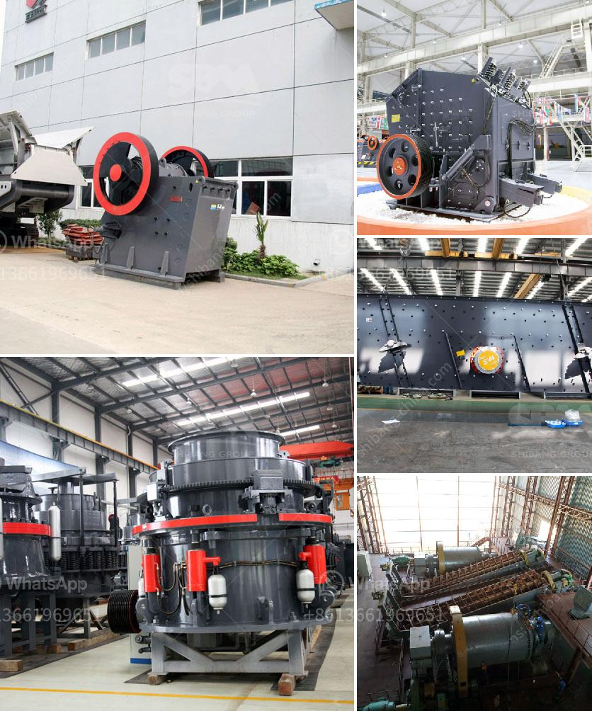

<h3>portable impact crushers</h3>
Portable impact crushers are versatile crushing machines that can be used in any stage of the crushing process. Due to their ability to produce precisely shaped end products, these crushers are commonly used in construction and demolition projects, as well as in mining operations.

One significant advantage of portable impact crushers is their portability. As the name suggests, these crushers can be easily moved from one location to another, allowing contractors to save on transportation costs. This is particularly advantageous for projects that require crushing at multiple sites or for contractors working on different projects simultaneously. The ability to transport the crusher also enables contractors to access hard-to-reach areas, such as tight job sites or remote locations, where traditional crushers may not be feasible.

In addition to their portability, portable impact crushers offer several other benefits. These crushers are designed to handle a wide range of materials, including concrete, asphalt, limestone, and granite. Their powerful impact crushing capabilities allow them to easily break down even the toughest materials. The resulting end product is often uniform and of high quality, making it suitable for use in a variety of applications.

Portable impact crushers are equipped with a variety of features to enhance their performance and ease of use. One such feature is a vibrating grizzly feeder that allows for consistent feeding of material into the crusher. This ensures a continuous flow of material, preventing clogs or uneven feeding that could affect the crusher's performance. Other features, such as adjustable settings and hydraulic systems, provide operators with greater control over the finished product. This allows for precise adjustments to be made to the crusher's output, ensuring the desired end product size is achieved.

The maintenance of portable impact crushers is relatively easy, thanks to their design. Most models come with easily accessible maintenance points, such as inspection doors, which allow for quick and efficient inspection and maintenance of the crusher. In addition, many crushers are equipped with self-lubricating systems, reducing the need for regular lubrication and ensuring optimal performance.

Portable impact crushers also offer environmental benefits. With the use of advanced technology, these crushers can significantly reduce noise and dust emissions. This is especially important in urban areas, where noise and air pollution are major concerns. Additionally, portable impact crushers can be powered by diesel engines or electric motors, allowing for cleaner and more sustainable operation.

In conclusion, portable impact crushers are valuable tools in the construction and mining industries. Their versatility, portability, and powerful crushing capabilities make them ideal for a wide range of applications. Whether it's crushing concrete, asphalt, limestone, or other materials, these crushers deliver high-quality end products. With their ease of maintenance and environmentally friendly operation, portable impact crushers are a reliable and efficient choice for contractors and operators around the world.
<h3>Contact us</h3><ul><li><strong>Whatsapp:&nbsp;<a href="https://wa.me/8613661969651">+8613661969651</a></strong></li><li><a href="https://swt.shibang-china.com/?git&amp;zhl&amp;portable impact crushers"><strong>Online Service(chat now)</strong></a></li></ul><h3>Related</h3><ul><li><a href='mining process of mica crusher.md'>mining process of mica crusher</a></li><li><a href='how to get aluminum from bauxite.md'>how to get aluminum from bauxite</a></li><li><a href='screw conveyor blade calculation.md'>screw conveyor blade calculation</a></li><li><a href='concrete crushing equipment price.md'>concrete crushing equipment price</a></li><li><a href='ballast crushing machine in kenya.md'>ballast crushing machine in kenya</a></li></ul>