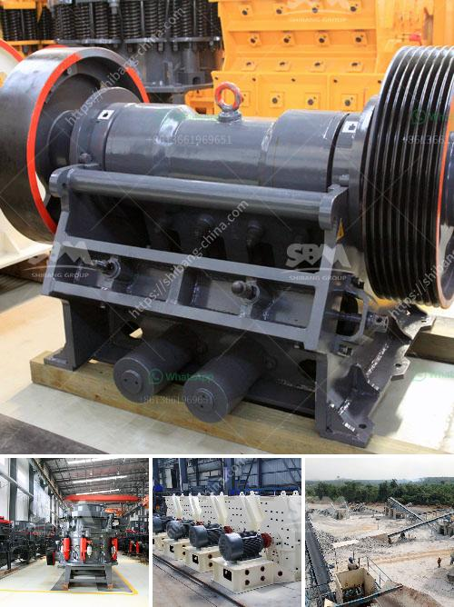

<h3>portable stone crusher for sale india price</h3>
A stone crushing machine is designed to reduce large rocks into smaller and more manageable particles. Portable stone crusher for sale in India provides the most efficient and reliable stone crushers, thus enabling rapid development of small-scale infrastructure projects in remote areas. Even during the pandemic, India has continued to witness accelerated construction activities, attracting several stone crushing companies to invest in the region.

One major factor that boosts the popularity of portable stone crushers is their ability to be installed and transported easily. This attribute makes these machines highly versatile, allowing them to crush rocks in various locations. Whether it is a construction site, mining site, or a remote rural area with no access to traditional stone crushers, portable stone crushers become the go-to solution.

In addition to their portability, these crushers also offer users the option to adjust the size of the final product. This feature enables users to produce different sizes of stones, which can be used for various purposes in construction and infrastructure projects. The ability to adjust the size of stones comes from the powerful crushing mechanism found within these machines. Their robust design and high-performance capabilities ensure efficiency and productivity during the crushing process.

As India sees rapid urbanization and industrialization, the demand for construction materials increases. Portable stone crushers provide a convenient way to offer the required materials and meet the demand. With a variety of applications, these crushers are essential for large-scale construction projects, ensuring a steady supply of crushed stones.

Moreover, the cost-effectiveness of portable stone crushers is an attractive advantage for potential buyers. The low operating costs and reduced maintenance requirements make these crushers a viable option for small and medium-sized businesses. As a result, many entrepreneurs in India have successfully invested in portable stone crushers, creating a competitive market.

When considering purchasing a portable stone crusher, the price is a crucial factor for many customers. To ensure that customers receive the best value for their money, various factors should be taken into account. For instance, the quality and durability of the machine should be evaluated to ensure it can withstand harsh working conditions. Additionally, the after-sales service and availability of spare parts should be considered, as these factors contribute to the long-term performance of the crusher.

In conclusion, portable stone crushers have revolutionized the construction industry in India. Their portability, versatility, and cost-effectiveness have made them a popular choice among entrepreneurs and small-scale contractors. The ability to crush rocks in various locations and adjust the size of the final product have further augmented their appeal. As India continues to witness a surge in construction activities, the demand for portable stone crushers will only increase, making them a lucrative investment.
<h3>Contact us</h3><ul><li><strong>Whatsapp:&nbsp;<a href="https://wa.me/8613661969651">+8613661969651</a></strong></li><li><a href="https://swt.shibang-china.com/?git&amp;zhl&amp;portable stone crusher for sale india price"><strong>Online Service(chat now)</strong></a></li></ul><h3>Related</h3><ul><li><a href='jaw crusher size.md'>jaw crusher size</a></li><li><a href='small cement grinding machine.md'>small cement grinding machine</a></li><li><a href='sand making machine.md'>sand making machine</a></li><li><a href='hammer mill diagram.md'>hammer mill diagram</a></li><li><a href='method statement of installation conveyor belt.md'>method statement of installation conveyor belt</a></li></ul>