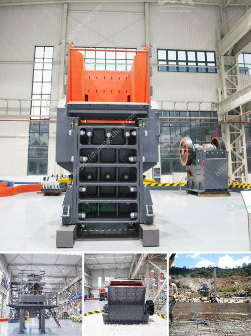

<h3>potash ore crusher</h3>
Potash ore is the common name given to a variety of minerals containing potassium. Potassium is an essential nutrient for plants and plays a vital role in crop production, particularly for the development of strong and healthy plant roots. Potash ore can be considered a valuable resource for the potassium it contains, which is sought after by the agricultural industry.

To extract potassium from potash ore, the ore must be processed through various stages, including crushing and grinding. Potash ore crushers are widely used in the mining industry for crushing and grinding potash ore. Potash ore crusher is an important tool in potash mining operations, as well as in the crushing and grinding of other minerals.

One of the main advantages of the potash ore crusher is the reduction in downtime and maintenance. Potash ore crushers are equipped with hydraulically assisted gap settings, which help to reduce downtime and maintenance substantially. Additionally, these crushers are designed to be compact and easy to transport, enabling them to be used in remote locations where potash ores are often found.

The potash ore crusher machine supplied by our company, including primary crusher and secondary crusher, is mainly used to crush various ores and bulk materials into smaller particles. The primary crusher is usually jaw crusher or cone crusher, which can reduce the ore size from as large as 1.5m to 20-30cm. The secondary crusher typically consists of cone crusher or impact crusher, which can reduce the ore size from as large as 300mm to less than 100mm.

Potash ore crushers are specially designed to reduce the size of ore particles to a finer range, suitable for handling and processing. This allows for higher extraction rates and more efficient use of resources. The crushing process of potash ore involves multi-stage crushing and grinding to meet the desired particle size for further processing.

In addition to their crushing capabilities, potash ore crushers are also capable of grinding potash ores into a fine powder. This powder can be used directly as an additive in fertilizers, or further processed to produce potash granules or pellets. This versatility allows for a wide range of applications, making potash ore crushers a critical tool in the potash industry.

The demand for potash fertilizers continues to grow as global food production increases to meet the needs of a growing population. Potash ore crusher plays a vital role in the potash ore processing plant in terms of crushing large pieces of potash ore into smaller particles. With their high efficiency and low maintenance costs, potash ore crushers are increasingly popular in potash mining operations.

In conclusion, the potash ore crusher is a vital tool in the potash industry, serving as a critical processing step to efficiently separate potassium from potash ore. With its higher extraction rates and reduced maintenance downtime, the potash ore crusher enables the efficient use of resources in the industry and contributes to the production of high-quality fertilizers.
<h3>Contact us</h3><ul><li><strong>Whatsapp:&nbsp;<a href="https://wa.me/8613661969651">+8613661969651</a></strong></li><li><a href="https://swt.shibang-china.com/?git&amp;zhl&amp;potash ore crusher"><strong>Online Service(chat now)</strong></a></li></ul><h3>Related</h3><ul><li><a href='differences between jaw and gyratory crushers.md'>differences between jaw and gyratory crushers</a></li><li><a href='roller crusher on sale.md'>roller crusher on sale</a></li><li><a href='cement clinker processing equipment.md'>cement clinker processing equipment</a></li><li><a href='coal crusher machine prices in india.md'>coal crusher machine prices in india</a></li><li><a href='hammer mill for sale ebay.md'>hammer mill for sale ebay</a></li></ul>