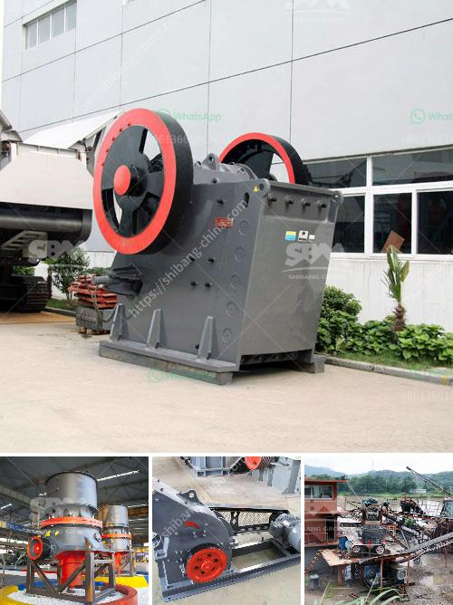

<h3>powder making machine south africa</h3>
South Africa, known for its thriving industrial sector, has seen an exponential growth in various manufacturing industries. One of the key components that has played a significant role in this development is the powder making machine. These machines have revolutionized the way powders are produced and have become an integral part of many manufacturing processes across the country.

Powder making machines are designed to produce a wide range of powders, from fine to coarse, catering to the diverse needs of industries such as pharmaceuticals, cosmetics, food processing, and agriculture. These machines essentially crush, grind, and blend various raw materials to create a consistent and homogeneous powder. The powder making process ensures maximum efficiency, uniformity, and quality, enhancing the overall product value.

A key advantage of investing in a powder making machine in South Africa is the access to a wide array of raw materials available in the region. South Africa is renowned for its rich mineral resources, which can be utilized in the powder making process. The abundance of minerals such as limestone, feldspar, quartz, and talc enables manufacturers to produce superior quality powders at competitive prices. This becomes a significant advantage, as it reduces the reliance on imported powders and fosters local production and self-sustainability.

Furthermore, the powder making machine industry in South Africa has witnessed substantial technological advancements in recent years. Manufacturers have adopted state-of-the-art equipment and machinery, incorporating automation and advanced grinding techniques. This has resulted in higher productivity, reduced production costs, and enhanced product quality. Additionally, these machines are designed with energy-efficiency in mind, reducing the overall carbon footprint and promoting a greener approach to manufacturing.

The impact of powder making machines on South Africa's economy cannot be understated. The growth in manufacturing industries has created employment opportunities and contributed to economic development. The demand for these machines has also opened doors for local entrepreneurs to establish their manufacturing units, fostering entrepreneurship and innovation.

Moreover, the powder making machine industry has enabled South African manufacturers to cater to domestic as well as international markets. The country's favorable geographical location acts as a gateway to regional markets, including neighboring countries and the larger African continent. The availability of locally manufactured powders has not only reduced import dependence but has also enhanced South Africa's reputation as a reliable supplier of quality products.

However, challenges remain to be addressed. The availability of skilled labor and the adoption of cutting-edge technologies continue to be areas of focus for the powder making machine industry in South Africa. Investments in training and development of human resources can help bridge this gap, ensuring a skilled workforce to operate and maintain these machines effectively.

In conclusion, the powder making machine industry in South Africa has emerged as a crucial element in the country's manufacturing sector. With its diverse range of raw materials, technological advancements, and economic benefits, these machines have propelled the growth of several industries. As the world moves towards sustainable and environmentally friendly manufacturing practices, the powder making machine industry will continue to play a vital role in South Africa's journey towards manufacturing excellence.
<h3>Contact us</h3><ul><li><strong>Whatsapp:&nbsp;<a href="https://wa.me/8613661969651">+8613661969651</a></strong></li><li><a href="https://swt.shibang-china.com/?git&amp;zhl&amp;powder making machine south africa"><strong>Online Service(chat now)</strong></a></li></ul><h3>Related</h3><ul><li><a href='quartz stone machine of india.md'>quartz stone machine of india</a></li><li><a href='marble powder mill machinery.md'>marble powder mill machinery</a></li><li><a href='trommel screen suppliers in india.md'>trommel screen suppliers in india</a></li><li><a href='aggregate crusher types.md'>aggregate crusher types</a></li><li><a href='calcium carbonate making machinery in germany.md'>calcium carbonate making machinery in germany</a></li></ul>