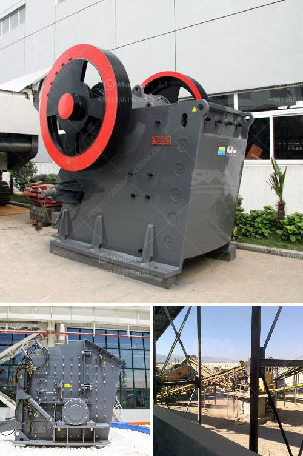

<h3>powder manufacturing for quartz feldspar crusher</h3>
In the field of powder manufacturing, particle size reduction is a crucial step. It plays a key role in determining the quality, purity, and performance of the final product. When it comes to quartz and feldspar crushers for powder manufacturing, progress in technology has opened new doors for an extensive range of applications. In this article, we will explore the significance of powder manufacturing for quartz feldspar crushers and delve into the potential they hold.

Quartz and feldspar are important raw materials found abundantly in nature. Their industrial applications are vast, ranging from glassmaking and ceramics to coatings and paints. To unleash the full potential of these minerals, the manufacturing process plays a pivotal role. Powder manufacturing, through crushers, empowers industries to obtain finely ground particles that enhance the physical and chemical properties of products.

One of the primary reasons for powder manufacturing is achieving a desired particle size distribution. Crushers designed specifically for quartz and feldspar break down larger raw materials into smaller particles, ensuring uniformity throughout the production process. This process is crucial in industries where consistency is vital and can significantly affect the quality of the final product.

Another advantage of powder manufacturing for quartz feldspar crushers is the ability to customize particle sizes. By using different crusher settings and configurations, manufacturers can produce powders with targeted particle sizes to meet specific requirements. For instance, certain applications may demand finer particles to improve the performance of the end product, while others might require coarser powders for enhanced flowability or reduced dusting.

Furthermore, powder manufacturing for quartz feldspar crushers allows for improved material handling. Smaller particle sizes obtained through crushing make it easier to dispense, mix, and incorporate into various formulations. This enables manufacturers to enhance the homogeneity and workability of their products, leading to better end-user experiences and higher customer satisfaction.

Efficient powder manufacturing also contributes to cost optimization. Finely ground powders are generally more reactive and exhibit better flow characteristics. These properties can lead to reduced energy consumption during processing, lower production cycle times, and improved overall productivity. By using crushers that can produce consistent and fine powders, manufacturers can achieve cost-effective operations while maintaining high-quality standards.

The advancement in technology has revolutionized powder manufacturing for quartz feldspar crushers. Modern crushers are equipped with state-of-the-art features that enhance their performance and efficiency. They offer increased crushing capacities, reduced downtime, and improved product yields. Additionally, advanced automation and control systems ensure precise and reliable particle size reduction, resulting in consistent powder quality.

To conclude, powder manufacturing for quartz feldspar crushers is a crucial step in the production of various industrial products. By obtaining finely ground particles, manufacturers can tailor the physical and chemical properties of their products to meet specific application requirements. This not only enhances the performance of the end products but also facilitates cost optimization and improves overall productivity. As technology continues to evolve, the possibilities in powder manufacturing for quartz feldspar crushers are limitless, unlocking the full potential of these important raw materials.
<h3>Contact us</h3><ul><li><strong>Whatsapp:&nbsp;<a href="https://wa.me/8613661969651">+8613661969651</a></strong></li><li><a href="https://swt.shibang-china.com/?git&amp;zhl&amp;powder manufacturing for quartz feldspar crusher"><strong>Online Service(chat now)</strong></a></li></ul><h3>Related</h3><ul><li><a href='netherland ore processing and crusher company.md'>netherland ore processing and crusher company</a></li><li><a href='stone crusher machine price list in bangladesh.md'>stone crusher machine price list in bangladesh</a></li><li><a href='jaw crusher mem fr90.md'>jaw crusher mem fr90</a></li><li><a href='buy stone quarry crusher equipment from europe.md'>buy stone quarry crusher equipment from europe</a></li><li><a href='lm vertical grinding mill.md'>lm vertical grinding mill</a></li></ul>