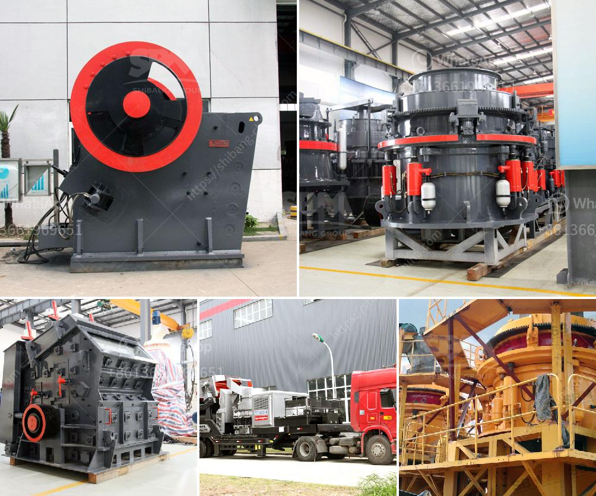

<h3>powder mill machines</h3>
In today's fast-paced manufacturing industry, efficiency and productivity are key. As manufacturers strive to meet growing demands and deliver high-quality products, the role of powder mill machines has become increasingly significant. These state-of-the-art machines have revolutionized the manufacturing process, enabling companies to produce powdered materials with utmost precision and speed.

Powder mill machines are designed to crush and grind various materials into fine powders, making them suitable for a wide range of industries. From pharmaceuticals and chemicals to food processing and construction, these machines play a vital role in ensuring product consistency and uniformity. By reducing materials to a powdered form, manufacturers can achieve improved blending, dispersion, and overall product quality.

One of the primary advantages of powder mill machines is their ability to process a variety of materials, including minerals, metals, polymers, and even certain types of organic matter. This versatility allows manufacturers to meet diverse requirements and produce customized products tailored to specific applications. Furthermore, these machines offer adjustable settings for particle size, enabling companies to control the final product's composition and characteristics according to their needs.

The efficiency of powder mill machines is particularly evident in the pharmaceutical industry, where accuracy and safety are essential. These machines enable pharmaceutical manufacturers to produce fine powders that can be easily incorporated into drugs and medications. The precise grinding capabilities of powder mill machines ensure that the pharmaceutical powders have consistent particle sizes, enhancing their effectiveness and ease of use.

In addition to their wide-ranging applications, powder mill machines are characterized by their energy-efficient operation and minimal waste production. These machines are designed to minimize material loss and maximize productivity, ensuring cost-effectiveness for manufacturers. As sustainability becomes an increasingly vital consideration in the manufacturing industry, powder mill machines offer a green solution by reducing waste and minimizing the ecological footprint.

With advancements in technology, powder mill machines continue to evolve to meet the ever-changing demands of manufacturers. The latest models incorporate advanced features such as automated controls, real-time monitoring, and data analysis capabilities. These enhancements not only ensure heightened productivity but also allow for proactive maintenance and troubleshooting, reducing downtime and optimizing operational efficiency.

In conclusion, powder mill machines have played a transformative role in the manufacturing industry. Their ability to produce finely powdered materials with precision, versatility, and efficiency has revolutionized production processes across various sectors. As manufacturers seek to meet rising demands while maintaining product quality, the integration of powder mill machines has become indispensable. With ongoing technological advancements, these machines are set to shape the future of manufacturing, offering further efficiency gains, sustainability, and increased productivity.
<h3>Contact us</h3><ul><li><strong>Whatsapp:&nbsp;<a href="https://wa.me/8613661969651">+8613661969651</a></strong></li><li><a href="https://swt.shibang-china.com/?git&amp;zhl&amp;powder mill machines"><strong>Online Service(chat now)</strong></a></li></ul><h3>Related</h3><ul><li><a href='price of a mobile crasher sri lanka.md'>price of a mobile crasher sri lanka</a></li><li><a href='aggregate crusher 200 meter capacity.md'>aggregate crusher 200 meter capacity</a></li><li><a href='graphite production machine.md'>graphite production machine</a></li><li><a href='crusher machine kenya.md'>crusher machine kenya</a></li><li><a href='quarry stone for sale in malta.md'>quarry stone for sale in malta</a></li></ul>