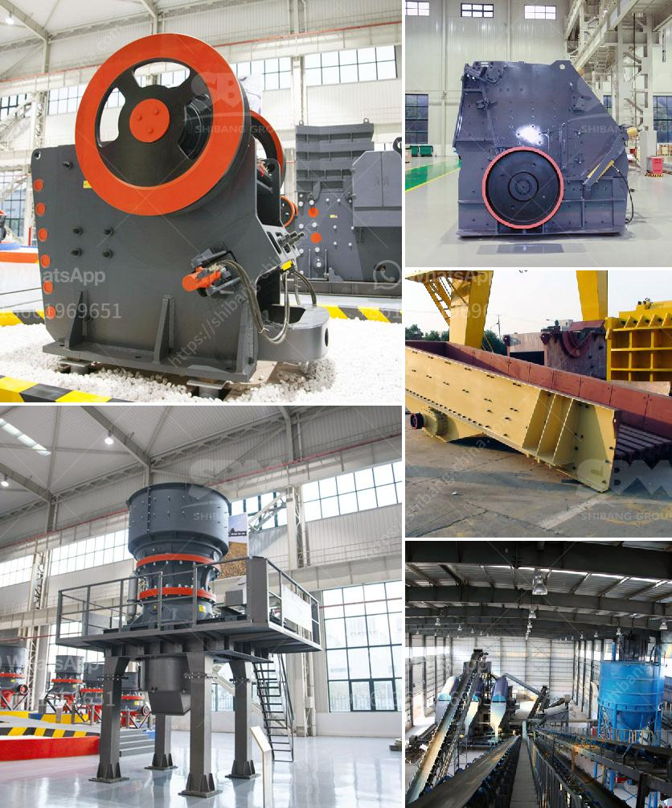

<h3>powdered limestone making places</h3>
Limestone, a sedimentary rock, has been widely used in construction and manufacturing for centuries due to its durability and aesthetic appeal. However, a lesser-known form of limestone, powdered limestone, has gained popularity in recent years for its diverse range of applications. This finely ground form of the rock has been revolutionizing the way certain places function, enhancing everything from agriculture to construction. In this article, we will explore the uses of powdered limestone and the positive impact it has on various industries.

One of the key areas where powdered limestone has found application is in agriculture. It serves as an essential ingredient in agricultural lime, a soil amendment used to neutralize acidic soils. The presence of acidic soils can severely limit plant growth and reduce agricultural productivity. By adding powdered limestone to acidic soils, the pH levels are raised, creating a more favorable environment for plant roots to absorb essential nutrients. This leads to healthier crop yields, improving food production and supporting sustainable agriculture.

Beyond improving soil health, powdered limestone is also used as a mineral supplement in animal feeds. Animals require a balanced intake of essential minerals for optimum growth and overall health. Powdered limestone provides a rich source of calcium and magnesium, crucial minerals for the development of strong bones and proper muscle function in livestock. Consequently, the inclusion of powdered limestone in animal diets ensures healthy and productive livestock, contributing to thriving agricultural practices.

Furthermore, powdered limestone's versatility extends to the manufacturing and construction industries. It serves as a crucial component in the production of cement, an essential binder for concrete. Cement, when mixed with water and aggregates, forms one of the most widely used construction materials in the world. The addition of powdered limestone in cement enhances both its strength and workability, resulting in sturdier structures and smoother finishes. This cost-effective addition not only boosts the performance of cement but also aids in reducing carbon emissions, making construction practices more sustainable.

In addition to construction, powdered limestone is utilized in several industrial processes. Its high calcium content makes it an ideal raw material for producing quicklime or calcium oxide. Quicklime is used in the production of steel, chemical manufacturing, and a host of other applications. It is also an integral part of flue gas desulfurization, where it is used to remove sulfur dioxide emissions from power plant exhausts, reducing air pollution and enhancing air quality.

The advantages of powdered limestone are not limited to large-scale industrial applications; it also finds a place in everyday items that we use at home. From toothpaste to paint, powdered limestone adds desired properties such as smoothness, consistency, and durability to these products. Its natural white color also makes it an excellent option for use as a pigment in cosmetics and paper manufacturing.

In conclusion, powdered limestone is transforming places in numerous ways, thanks to its versatility and wide-ranging applications. From improving agricultural productivity to strengthening construction materials, its impact is evident across industries. As we continue to evolve and seek sustainable solutions, the value of powdered limestone in meeting our growing needs cannot be overstated.
<h3>Contact us</h3><ul><li><strong>Whatsapp:&nbsp;<a href="https://wa.me/8613661969651">+8613661969651</a></strong></li><li><a href="https://swt.shibang-china.com/?git&amp;zhl&amp;powdered limestone making places"><strong>Online Service(chat now)</strong></a></li></ul><h3>Related</h3><ul><li><a href='crushers for sale.md'>crushers for sale</a></li><li><a href='sand and gravel quarrying company in bicol.md'>sand and gravel quarrying company in bicol</a></li><li><a href='equipment required for producing lime for new plant.md'>equipment required for producing lime for new plant</a></li><li><a href='denver ball mills.md'>denver ball mills</a></li><li><a href='method statement of installation conveyor belt.md'>method statement of installation conveyor belt</a></li></ul>