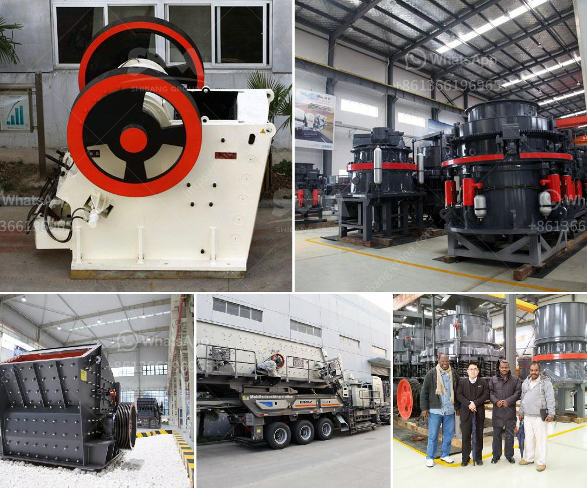

<h3>price conveyor price rock crusher</h3>
The price of a conveyor rock crusher can vary greatly depending on the size, features, and brand of the machine. With so many options available, it can be difficult to determine the exact price range for these types of crushers.

One of the main factors that determine the price of a conveyor rock crusher is its capacity. The larger the capacity, the higher the price tag. A larger capacity crusher can handle more rocks and produce higher quantities of crushed material. This is especially important in industries such as mining and construction, where large amounts of material need to be processed.

Another factor that influences the price is the brand of the crusher. Well-known and established brands often come with a higher price tag due to their reputation for quality and reliability. However, there are also affordable options available from lesser-known brands that can still deliver excellent performance.

Features and specifications also play a significant role in determining the price. For example, some rock crushers come with additional features such as adjustable height, variable speed controls, and built-in conveyors. These features can make the machine more versatile and efficient, but they also increase the price.

Finally, it's worth noting that prices for conveyor rock crushers can vary based on geographic location and market demand. In certain areas where there is a strong demand for these machines, prices may be higher due to increased competition.

In conclusion, the price of a conveyor rock crusher can range from affordable options to higher-end models depending on factors such as capacity, brand, features, and market demand. It's important to carefully evaluate these factors and consider your specific needs and budget when purchasing a rock crusher.
<h3>Contact us</h3><ul><li><strong>Whatsapp:&nbsp;<a href="https://wa.me/8613661969651">+8613661969651</a></strong></li><li><a href="https://swt.shibang-china.com/?git&amp;zhl&amp;price conveyor price rock crusher"><strong>Online Service(chat now)</strong></a></li></ul><h3>Related</h3><ul><li><a href='cost of the process of mining limestone.md'>cost of the process of mining limestone</a></li><li><a href='what is expected cost of 100 tph crushing plant.md'>what is expected cost of 100 tph crushing plant</a></li><li><a href='conveyor belt design manual pdf.md'>conveyor belt design manual pdf</a></li><li><a href='manufacturing company for ball mill.md'>manufacturing company for ball mill</a></li><li><a href='jaw crusher in germany used.md'>jaw crusher in germany used</a></li></ul>