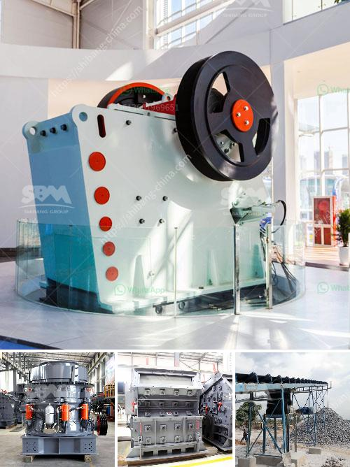

<h3>price for stone crusher plant</h3>
With the increasing need for sand and gravel aggregates in construction and other industries, the demand for stone crusher plants is growing more and more. For investors, the price of stone crusher plant is determined by the various factors, including the equipment’s models, capacity, and auxiliary equipment production technology, among others. However, for the budget-conscious customers, there are some factors they can consider when purchasing stone crushing plants.

Firstly, the price of a stone crusher plant is influenced by its capacity. Different capacities offer different levels of performance, durability, and reliability. Therefore, it’s important to choose a suitable capacity for your project needs. The general rule is that the larger the capacity, the higher the price. However, it’s crucial to strike a balance between capacity and cost to ensure that you are not overpaying for a plant that exceeds your requirements.

Secondly, the price of a stone crusher plant is influenced by the materials used in its construction. Therefore, when purchasing a stone crusher plant, it’s important to choose the right material to ensure its durability. The selection of materials may vary depending on the design, intended use, and budget of the project.

Thirdly, the price of a stone crusher plant depends on the performance of the machine. High performance equipment often has high costs, but it also has a long service life and a higher return on investment. Therefore, customers will not only consider the price when purchasing, but also take the production efficiency, maintenance cost, and other factors into account.

In addition to the above factors, the price of a stone crusher plant also depends on the manufacturers. Different manufacturers have diverse pricing strategies, and the overall market competition among manufacturers will also affect the price. Of course, good manufacturers will pay more attention to the quality and after-sales service of the equipment, which will lead to a higher price.

Though the price of a stone crusher plant is related to the model and capacity, the factors mentioned above also greatly influence the price. That’s why customers need to compare different manufacturers and choose the one with the most reasonable price. Usually, large-scale manufacturers will provide customers with more comprehensive services, reliable quality assurance, and professional technical support.

In conclusion, the price of a stone crusher plant depends on various factors, including the equipment’s models, capacity, materials, performance, and manufacturers. Therefore, for customers, it is crucial to choose a suitable and reliable manufacturer to buy a stone crushing plant that matches their project needs. By balancing the factors mentioned above, customers can find a cost-effective and high-performance crushing plant to create more economic benefits.
<h3>Contact us</h3><ul><li><strong>Whatsapp:&nbsp;<a href="https://wa.me/8613661969651">+8613661969651</a></strong></li><li><a href="https://swt.shibang-china.com/?git&amp;zhl&amp;price for stone crusher plant"><strong>Online Service(chat now)</strong></a></li></ul><h3>Related</h3><ul><li><a href='ball milling in bangalore.md'>ball milling in bangalore</a></li><li><a href='stone crushing in mineral processing.md'>stone crushing in mineral processing</a></li><li><a href='marble grinder mill machine.md'>marble grinder mill machine</a></li><li><a href='mobile crushing and screening contractors south africa.md'>mobile crushing and screening contractors south africa</a></li><li><a href='ball milling method in tamil.md'>ball milling method in tamil</a></li></ul>