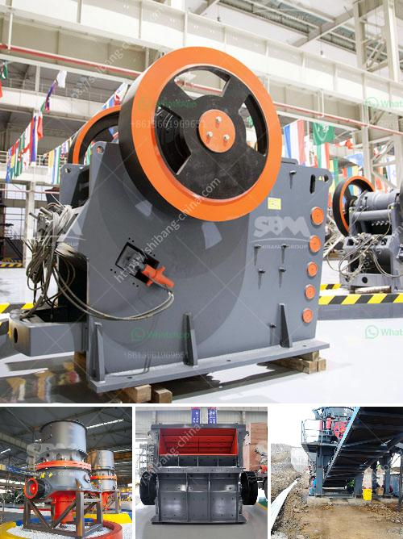

<h3>price for stone crusher</h3>
Price for stone crusher is fluctuating and  is subject to change due to various factors including product quality and capacity, location, demand, supply, etc. In this article, we will analyze the main factors affecting the price for stone crusher and provide some suggestions for those who are planning to purchase a stone crusher.

Firstly, the quality of the stone crusher will directly affect its price. Besides, the size and weight of the crusher also play a vital role in determining its price. Generally, a bigger size and heavier stone crusher will cost more than a smaller one.

Another factor that affects the price is the capacity of the stone crusher. Different models have different capacities, and the higher the capacity, the more expensive the crusher will be. Therefore, it is crucial to determine the required capacity of the stone crusher based on your production needs before making a purchase decision.

Additionally, the price of a stone crusher can also be influenced by the location where it is sold. For example, in regions where labor and raw materials cost are higher, the price of the stone crusher can be relatively higher compared to regions with lower production costs. Therefore, it is advisable to consider purchasing the stone crusher from regions where the cost of production is relatively lower.

Demand and supply also play a major role in determining the price of a stone crusher. If there is a high demand for stone crushers in the market, the price may increase due to the limited supply. On the other hand, if the demand is low, the price may decrease. It is essential to closely monitor the market demand and supply situation to make an informed decision on when to purchase a stone crusher.

Lastly, it is important to consider additional costs such as transportation, installation, and maintenance when calculating the total price for a stone crusher. These costs can vary depending on the distance between the supplier and the buyer, the complexity of installation, and the requirements for maintenance and repair. It is advisable to factor in these additional costs to get an accurate estimation of the total price.

In conclusion, the price for a stone crusher is influenced by various factors, including product quality, capacity, location, demand, supply, etc. To make an informed decision, it is crucial to consider these factors and analyze the market situation. By doing so, you can ensure that you purchase a stone crusher that meets your production needs at a reasonable price.
<h3>Contact us</h3><ul><li><strong>Whatsapp:&nbsp;<a href="https://wa.me/8613661969651">+8613661969651</a></strong></li><li><a href="https://swt.shibang-china.com/?git&amp;zhl&amp;price for stone crusher"><strong>Online Service(chat now)</strong></a></li></ul><h3>Related</h3><ul><li><a href='economic analysis of conveyor system.md'>economic analysis of conveyor system</a></li><li><a href='raymond mill in india.md'>raymond mill in india</a></li><li><a href='diagram of a hammer mill.md'>diagram of a hammer mill</a></li><li><a href='how to get aluminum from bauxite.md'>how to get aluminum from bauxite</a></li><li><a href='dolomite stone crusher plant.md'>dolomite stone crusher plant</a></li></ul>