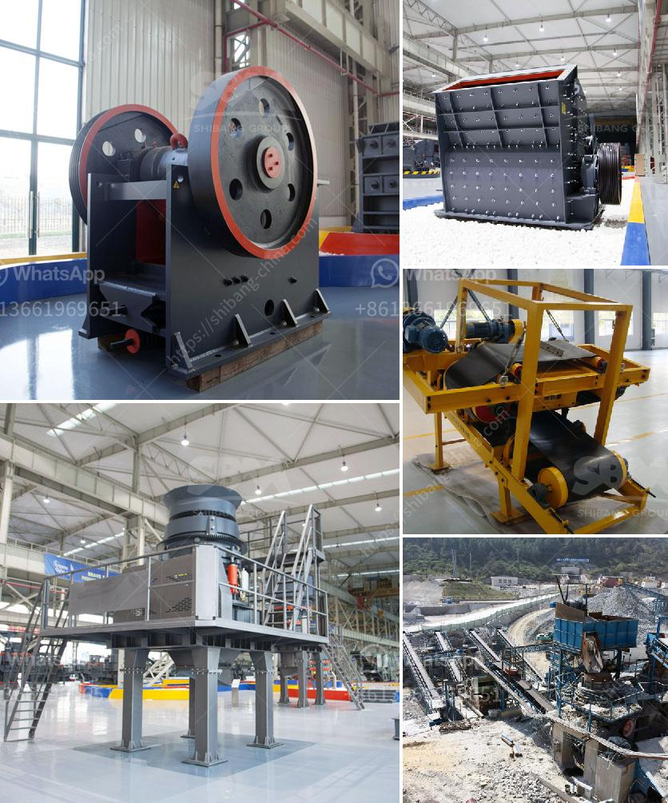

<h3>price hammer mill capacity of made in china</h3>
Hammer mill, as one of the ore crushing equipment, is able to crush the ores below 50mm or tailings and middlings that are not released completely. The released output could be concentrated by shaking table in the next process. Being suitable for small scale nonferrous and precious metal mines like tungsten, tin, gold, the hammer mill could be the alternative of ball mill in some extent. It is with easy installation and operation, low investment and quick effect. Its sieve opening size, minimum 1mm, can be customize configured as per the actual ore situation.

The hammer mill of Jiangxi Jinshibao Mining Machinery Manufacturing Co., Ltd is designed and manufactured as per the latest market demand, considering the crushing degree and fineness. As the leading brand in China, it supports on-shaft rotor unit and variouty of ring sieves. The machine has some features such as high efficiency, energy saving, wear resistance, adjustable fineness, easy installation and operation, etc. It is suitable for non-metallic minerals including marble, limestone, barite, clay, dolomite, feldspar, gypsum, etc.

We all know that China is a big country with lots of manufacturers and suppliers, so what is the price of such a large-scale hammer mill with a capacity between 300 and 500 tons per hour? You may be curious. Furthermore, before purchasing the equipment, you need to know whether the manufacturer supports customization, the after-sales service quality, and the integrity of the manufacturer.

In China, a hammer mill with a capacity of 300-500t/h, with a sieve hole diameter of 2-4 mm is sufficient for processing the material discharged from the jaw crusher. Many manufacturers and suppliers of hammer mill machines are available in the market. Choosing one whose price is of reasonable ratio with its quality is crucial.

To ensure efficiency and durability, many hammer mill manufacturers in China now adopt advanced composite materials to produce wear-resistant parts. This not only saves costs but also ensures that the operator will not face any interruption during operation. Additionally, it helps to improve the production efficiency of the hammer mill.

As for the price of the hammer mill, it varies based on the type of machine and the capacity. Generally, the smaller the capacity of the hammer mill, the lower the price. Furthermore, the prices also depend on factors such as material, brand, and the supplier of the machine.

In conclusion, the hammer mill made in China has been the most suitable equipment for the majority of large and small feed mills. It is the first choice of the majority of users, investment is small, and the income is high. According to relevant sources, the 80% of newly build crusher plants adopt the hammer crusher, which pushes forward the development of the hammer mill market in China.

In summary, when choosing a hammer mill, it is necessary to first determine the scale of the production line and the manufacturers that can provide equipment. Then, compare the quality, performance, and price of several manufacturers. Finally, choose the equipment that best meets the needs of the production line while within your budget.
<h3>Contact us</h3><ul><li><strong>Whatsapp:&nbsp;<a href="https://wa.me/8613661969651">+8613661969651</a></strong></li><li><a href="https://swt.shibang-china.com/?git&amp;zhl&amp;price hammer mill capacity of made in china"><strong>Online Service(chat now)</strong></a></li></ul><h3>Related</h3><ul><li><a href='cost of stone crusher in nigeria.md'>cost of stone crusher in nigeria</a></li><li><a href='german technology ball grinding machine.md'>german technology ball grinding machine</a></li><li><a href='slag grinding mill.md'>slag grinding mill</a></li><li><a href='conveyor belt manufacturer in saudi arabia.md'>conveyor belt manufacturer in saudi arabia</a></li><li><a href='quarring of building stones crusher in pakistan.md'>quarring of building stones crusher in pakistan</a></li></ul>