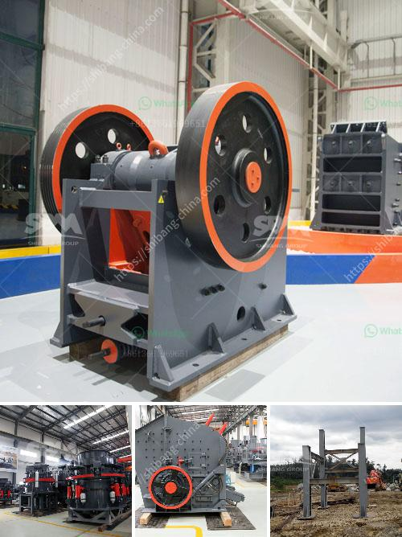

<h3>price jaw crusher 100tph india</h3>
The demand for jaw crushers is increasing steadily over the years due to its proclivity for crushing heavy materials and large mining operations. In India, the stone crushing industry is an important industrial sector in the country and it plays a significant role in the economic development of India. The increasing urbanization, rapid industrialization, as well as the construction activities in the country, have boosted the demand for aggregates and crushed stones, thereby driving the growth of the jaw crusher market.

One of the key factors contributing to the growth of the jaw crusher market in India is the favorable government initiatives undertaken to enhance the country's infrastructural development. The government's ambitious plans such as Housing for All and Smart Cities Mission have allocated a substantial budget for infrastructure development, which includes highways, railways, airports, and other key projects. This has led to a surge in demand for aggregates and construction materials, consequently bolstering the demand for jaw crushers.

When it comes to choosing a jaw crusher, there are several factors that need to be taken into consideration. The primary factor is the maximum feed size of the crusher. A jaw crusher should be able to handle a maximum feed size of up to 90% of the jaw opening width. Larger feed size means greater throughput and higher productivity. The capacity of a jaw crusher is also a crucial factor. It determines how much material can be crushed in a given time period. For a 100tph jaw crusher, the recommended capacity is approximately 250-300tph.

Another important consideration is the total weight of the crusher. A heavy jaw crusher would be difficult to transport and maneuver, making it less suitable for portable applications. Additionally, the build quality of the crusher should be robust and durable, ensuring long-term reliability and performance. The crusher should also have a high crushing ratio, which means that the material is crushed in a single pass, minimizing the need for secondary crushing.

Speaking of the price of a 100tph jaw crusher in India, it depends on various factors such as the manufacturer, the brand, the type of crusher, and other specifications. The price range starts from around INR 20 lakhs and can go up to INR 50 lakhs or more. Some of the leading manufacturers in India offering high-quality jaw crushers include Metso, Sandvik, Puzzolana, and Terex. These manufacturers provide a wide range of jaw crushers with different specifications to cater to the diverse needs of the customers.

In conclusion, the jaw crusher market in India is witnessing steady growth driven by the government's infrastructural development plans and the construction boom in the country. Choosing the right jaw crusher with appropriate specifications, capacity, and price is crucial for the success of any mining or construction project. Intensive research and professional advice should be sought before making a purchase decision to ensure optimal performance and long-term value for money.
<h3>Contact us</h3><ul><li><strong>Whatsapp:&nbsp;<a href="https://wa.me/8613661969651">+8613661969651</a></strong></li><li><a href="https://swt.shibang-china.com/?git&amp;zhl&amp;price jaw crusher 100tph india"><strong>Online Service(chat now)</strong></a></li></ul><h3>Related</h3><ul><li><a href='iron processing plant in mexico.md'>iron processing plant in mexico</a></li><li><a href='stone crusher machine uk.md'>stone crusher machine uk</a></li><li><a href='mobile crushing and screening.md'>mobile crushing and screening</a></li><li><a href='lime powder machine.md'>lime powder machine</a></li><li><a href='south africa manufacturer of mobile gold processing plant.md'>south africa manufacturer of mobile gold processing plant</a></li></ul>