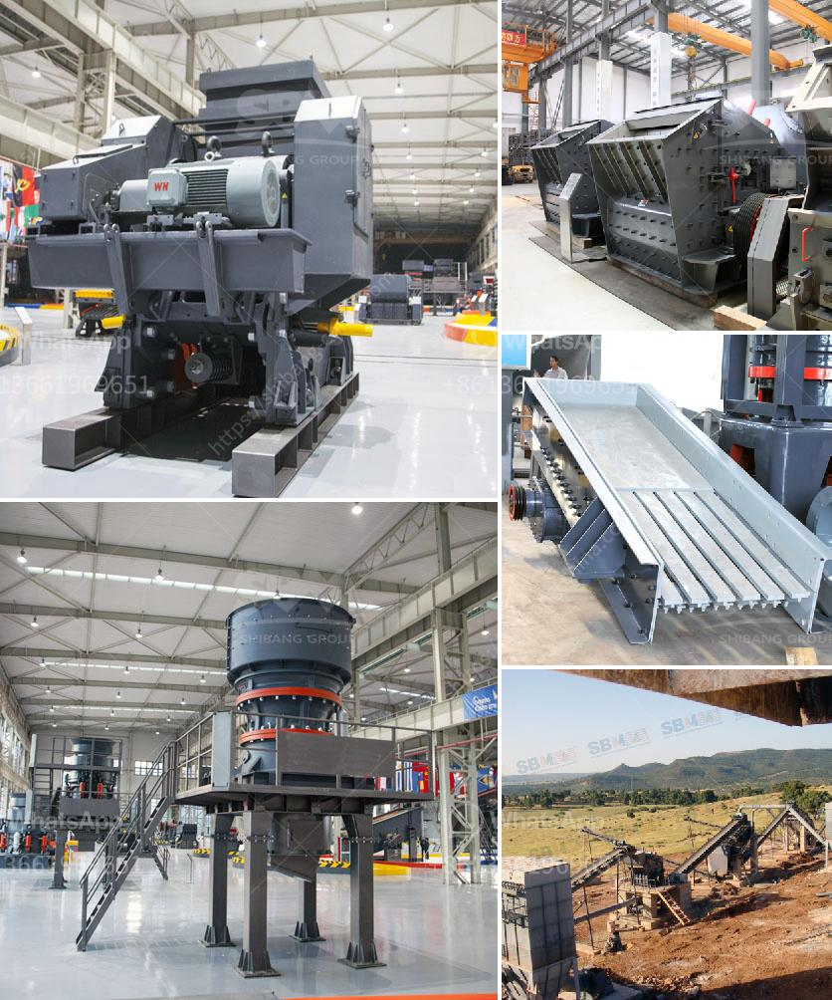

<h3>price list for crusher machine sayaji</h3>
Sayaji crusher machines have dominated the market as they are affordable yet powerful enough to crush large volumes of raw materials efficiently. They typically operate with a single toggle jaw crusher and have a sturdy body that ensures longevity. These machines come with an array of innovative features and are available in various sizes to meet customers' diverse needs.

The price list for Sayaji crusher machines is based on the model, type of machines, and capacity. For instance, sayaji jaw crushers are available in four different models, ranging from the 1000x250mm to the 1500x500mm size. These machines are priced at around INR 6 lakhs to INR 30 lakhs, while the gyratory crushers are available in capacities ranging from 100 to 500 tph. The gyratory crushers are priced at around INR 80 lakhs to INR 3 crores each. These prices include the basic machinery, motor, starter, hydraulic system, lubrication system, and other accessories.

Apart from the basic machinery, customers can also customize their crusher machines by adding additional features like separate motor control panel, heavy-duty bearings, belt conveyors, feed hoppers, and more. Each added feature will increase the overall cost of the machine. Furthermore, customers can choose various types of crusher machines, including jaw crushers, impact crushers, cone crushers, and vertical shaft impactors, depending on their specific requirements.

Sayaji crusher machines are known for their exceptional performance, low maintenance, and ease of operation. They are widely used in various industries like mining, construction, road and railway building, and more. Whether it is for crushing stones, coal, or any other material, Sayaji crushers can efficiently handle the task. If you are looking for an affordable yet high-quality crusher machine, Sayaji crushers should be your top choice.

In conclusion, Sayaji crusher machines provide excellent value for money as they offer high-performance crushing solutions at reasonable prices. Whether you need a jaw crusher, impact crusher, or cone crusher, Sayaji machines can deliver. So, if you are interested in buying a Sayaji crusher machine, make sure to check the price list and determine the specific requirements of your project to get the best-suited machine for your needs.
<h3>Contact us</h3><ul><li><strong>Whatsapp:&nbsp;<a href="https://wa.me/8613661969651">+8613661969651</a></strong></li><li><a href="https://swt.shibang-china.com/?git&amp;zhl&amp;price list for crusher machine sayaji"><strong>Online Service(chat now)</strong></a></li></ul><h3>Related</h3><ul><li><a href='model project of soap stone powder.md'>model project of soap stone powder</a></li><li><a href='portable impact crushers.md'>portable impact crushers</a></li><li><a href='mobile jaw crushers.md'>mobile jaw crushers</a></li><li><a href='mobile crusher in fiji.md'>mobile crusher in fiji</a></li><li><a href='how to ball mill magnesium.md'>how to ball mill magnesium</a></li></ul>