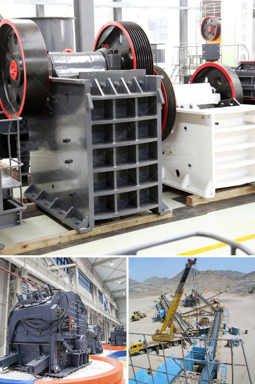

<h3>price of a mobile crasher sri lanka</h3>
Mobile crushers have become an essential part of modern construction and excavating projects. These versatile machines allow for both efficient crushing and screening of various materials, including concrete, recycling asphalt, and quarrying stone. Sri Lanka, an emerging economy in South Asia, has seen a significant increase in construction activities in recent years. As a result, the demand for mobile crushers has been on the rise, prompting many Sri Lankan suppliers to offer a wide range of models tailored to suit different budgetary constraints.

The price of mobile crushers in Sri Lanka can vary depending on multiple factors, including the model, brand, and technical specifications. Generally, there are three price ranges: low-end, mid-range, and high-end crushers.

In the low-end price range (approximately $5,000 to $15,000), customers can expect basic models with limited features and lower production capacities. These crushers are suitable for small-scale projects and contractors on a tight budget. They may have a lower horsepower and simpler control systems compared to higher-priced models.

The mid-range price category (around $15,000 to $30,000) offers more advanced features and improved production capacities. These crushers provide better efficiency and durability, making them suitable for medium-sized construction companies and contractors involved in larger projects. They may include additional options such as remote control, high-performance engines, and enhanced safety measures.

The high-end price range (above $30,000) includes top-of-the-line mobile crushers with cutting-edge technology and exceptional production capacities. These advanced machines are ideal for large construction firms and contractors engaged in major infrastructure projects. They are equipped with the latest features like GPS tracking, automatic feeding systems, and intelligent control systems for maximum efficiency.

It is important to note that the prices mentioned above are indicative and may vary depending on market conditions, currency exchange rates, and individual supplier discounts or promotions. Furthermore, additional costs, such as transportation, installation, and post-purchase services, should be considered while budgeting for a mobile crusher.

In conclusion, the price of mobile crushers in Sri Lanka varies based on various factors, including the model, brand, and technical specifications. It is essential for potential buyers to assess their specific requirements and budget constraints before making a purchase. Comparing different suppliers, obtaining quotes, and understanding the after-sales support offered by each supplier can help customers make informed decisions and ensure a successful purchase of a mobile crusher suitable for their construction needs.
<h3>Contact us</h3><ul><li><strong>Whatsapp:&nbsp;<a href="https://wa.me/8613661969651">+8613661969651</a></strong></li><li><a href="https://swt.shibang-china.com/?git&amp;zhl&amp;price of a mobile crasher sri lanka"><strong>Online Service(chat now)</strong></a></li></ul><h3>Related</h3><ul><li><a href='project report on m sand.md'>project report on m sand</a></li><li><a href='coal screening equipment price.md'>coal screening equipment price</a></li><li><a href='stone crushing machines.md'>stone crushing machines</a></li><li><a href='raymond mills in india.md'>raymond mills in india</a></li><li><a href='gypsum powder suppliers in india.md'>gypsum powder suppliers in india</a></li></ul>