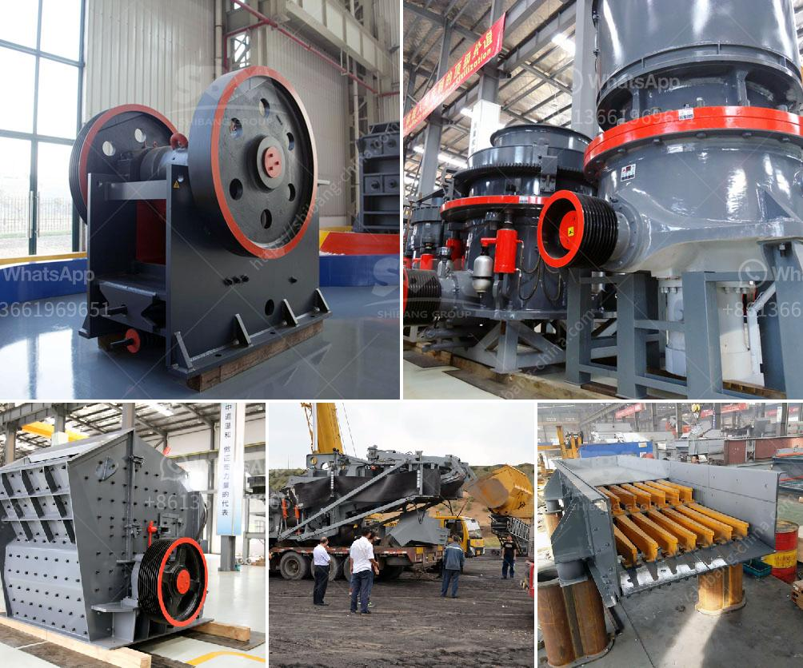

<h3>price of a tph sand fluidized bed dryer</h3>
The price of a TPH (Tonnes Per Hour) sand fluidized bed dryer can vary depending on various factors. These factors include the brand, model, capacity, features, and the supplier you choose to purchase from. 

A TPH sand fluidized bed dryer is a key equipment used in industries such as mining, construction, and foundries to remove moisture from sand particles, ensuring optimal quality and performance. With its ability to effectively remove moisture through a drying process using hot air, it helps in reducing energy consumption and production costs.

The price range for a TPH sand fluidized bed dryer can start from a few thousand dollars and go up to tens of thousands of dollars. The cost mainly depends on the capacity of the dryer. Higher capacity models tend to have a higher price due to their ability to handle larger quantities of sand at a time.

Additionally, the price can also vary based on the features and technology incorporated into the dryer. Advanced features such as automated controls, energy-efficient designs, and enhanced drying performance can contribute to a higher price.

It is important to consider not only the initial cost but also long-term operational costs when evaluating the price of a TPH sand fluidized bed dryer. Factors like energy consumption, maintenance requirements, and durability can affect the overall cost of ownership.

To determine the most suitable dryer for your needs at a reasonable price, it is advisable to compare different brands and models, request quotes from multiple suppliers, and consider customer reviews and feedback. This will help you make an informed decision and find the best value for your investment.

In conclusion, the price of a TPH sand fluidized bed dryer can vary depending on several factors, including capacity, features, and supplier. It is crucial to consider both the initial cost and long-term operational costs to make an informed decision. By comparing different options and evaluating customer reviews, you can find a dryer that meets your requirements while offering a reasonable price.
<h3>Contact us</h3><ul><li><strong>Whatsapp:&nbsp;<a href="https://wa.me/8613661969651">+8613661969651</a></strong></li><li><a href="https://swt.shibang-china.com/?git&amp;zhl&amp;price of a tph sand fluidized bed dryer"><strong>Online Service(chat now)</strong></a></li></ul><h3>Related</h3><ul><li><a href='kaolin portable crusher provider in nigeria.md'>kaolin portable crusher provider in nigeria</a></li><li><a href='vibrating feeder screen.md'>vibrating feeder screen</a></li><li><a href='small scale stone crusher for sale zimbabwe.md'>small scale stone crusher for sale zimbabwe</a></li><li><a href='iron ore smelter equipment.md'>iron ore smelter equipment</a></li><li><a href='vertical shaft impact crusher.md'>vertical shaft impact crusher</a></li></ul>