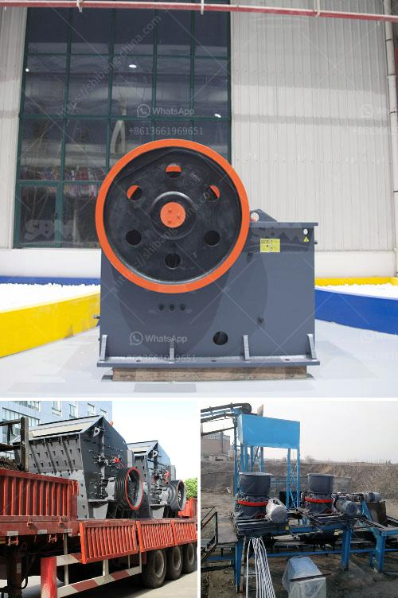

<h3>price of a vibrating screen</h3>
When it comes to purchasing vibrating screens, finding the right balance between price and quality is crucial. This vital piece of equipment plays a significant role in various industries, including mining, construction, and aggregate processing.

The price range of a vibrating screen can vary significantly based on several factors, including screen size, material quality, and manufacturing processes. While lower-priced screens might be appealing, it is crucial to consider the long-term benefits and reliability that come with investing in a higher-quality product.

The size of the vibrating screen is one of the primary factors that impact the price. Larger screens require more materials and manufacturing processes, which can drive up the cost. The intended use of the screen also affects its price. Screens used in heavy-duty applications, such as mining or quarrying, are designed to withstand harsh conditions and require a higher level of durability, resulting in a higher price tag.

Material quality is another crucial factor to consider. Vibrating screens are exposed to wear and tear due to constant vibrations and the presence of abrasive materials. Lower-priced screens often compromise on material quality, leading to faster deterioration and the need for frequent replacements. On the other hand, screens made from high-quality materials, such as stainless steel or durable synthetic alloys, are more expensive upfront but offer greater durability and a longer lifespan, resulting in cost savings in the long run.

Manufacturing processes also play a significant role in determining the price of a vibrating screen. Cutting-edge technologies and advanced manufacturing methods used to produce screens with intricate designs or specific features can increase the price. Additionally, screens manufactured by reputable companies that invest in research and development tend to have higher prices due to the added value and superior performance they offer.

Price should not be the sole determining factor when purchasing a vibrating screen. Instead, it is essential to consider the balance between quality and cost-effectiveness. A cheaper screen may initially seem like a cost-saving option, but it might compromise on performance, durability, and maintenance requirements.

Investing in a higher-priced vibrating screen not only ensures better build quality and longevity but also contributes to improved efficiency and productivity. High-quality screens offer better screening efficiency, leading to higher production rates and reduced downtime, thereby enhancing overall operational efficiency.

Moreover, reputable manufacturers often provide comprehensive customer support, warranties, and readily available spare parts. These services may not be readily available for lower-priced screens, leaving owners stranded in case of a breakdown.

In conclusion, the price of a vibrating screen is influenced by factors such as screen size, material quality, and manufacturing processes. While it may be tempting to opt for a lower-priced screen, it is crucial to consider the long-term benefits and cost savings associated with investing in a higher-quality product. By finding the perfect balance between cost and quality, businesses and industries can ensure reliable and efficient screening operations that contribute to overall growth and success.
<h3>Contact us</h3><ul><li><strong>Whatsapp:&nbsp;<a href="https://wa.me/8613661969651">+8613661969651</a></strong></li><li><a href="https://swt.shibang-china.com/?git&amp;zhl&amp;price of a vibrating screen"><strong>Online Service(chat now)</strong></a></li></ul><h3>Related</h3><ul><li><a href='concrete crushing equipment price.md'>concrete crushing equipment price</a></li><li><a href='ball mill design calculation pdf.md'>ball mill design calculation pdf</a></li><li><a href='advantages of single toggle jaw crusher.md'>advantages of single toggle jaw crusher</a></li><li><a href='cheap mobile crusher.md'>cheap mobile crusher</a></li><li><a href='to buy mobile crushing plant price.md'>to buy mobile crushing plant price</a></li></ul>